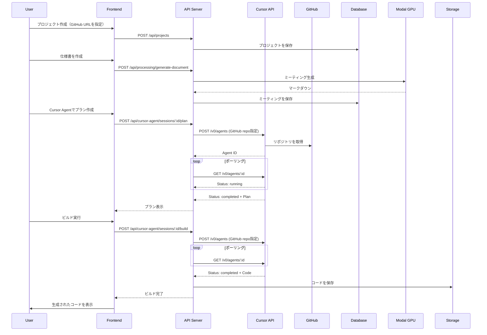

# Cursor Background Agent API 統合 - 実装完了レポート

## 📋 実装概要

Cursor Background Agent APIを使用した本格的なコード生成機能の統合が完了しました。

**実装日**: 2025-10-26  
**対応バージョン**: RealworldAgent v1.0

---

## ✅ 実装内容

### 1. データベーススキーマの更新

#### Projectモデルの拡張

```prisma
model Project {
  id          String   @id @default(uuid())
  name        String   @unique
  githubRepo  String?  // GitHubリポジトリURL（Cursor Agent用）
  githubBranch String? @default("main") // ブランチ名
  
  documents   ProjectDocument[]
  cursorAgentSessions CursorAgentSession[]
  
  createdAt   DateTime @default(now())
  updatedAt   DateTime @updatedAt
  
  @@index([name])
}
```

**変更点**:
- `githubRepo`: GitHubリポジトリURLを格納（Cursor API必須）
- `githubBranch`: 使用するブランチ名（デフォルト: main）

**マイグレーション**: `20251026015255_add_github_repo_to_projects`

### 2. Cursor Agent Service の更新

#### ファイル: `services/api-server/src/services/CursorAgentService.ts`

**主な変更**:

1. **正しいAPIエンドポイントの使用**
   ```typescript
   this.apiUrl = process.env.CURSOR_API_URL || 'https://api.cursor.com/v0';
   ```

2. **GitHubリポジトリのサポート**
   ```typescript
   interface CursorPlanRequest {
     specifications: string[];
     projectName: string;
     additionalContext?: string;
     githubRepo?: string;      // 追加
     githubBranch?: string;     // 追加
   }
   ```

3. **実際のAPI呼び出しフロー**
   ```typescript
   // エージェント作成
   POST /v0/agents
   Body: {
     prompt: { text: "..." },
     source: {
       repository: "https://github.com/user/repo",
       ref: "main"
     }
   }
   
   // ステータス確認（ポーリング）
   GET /v0/agents/{agent_id}
   
   // フォローアップ（オプション）
   POST /v0/agents/{agent_id}/followup
   Body: {
     prompt: { text: "..." }
   }
   ```

4. **完了待機ロジック**
   - ポーリング間隔: 5秒
   - 最大待機時間: 120秒
   - ステータス: pending → running → completed/failed/cancelled

5. **フォールバック機能**
   - APIキー未設定時: モック実装を使用
   - API呼び出し失敗時: モック実装にフォールバック
   - ユーザー体験を損なわない設計

### 3. APIルートの更新

#### Projects API (`services/api-server/src/routes/projects.ts`)

**プロジェクト作成**:
```typescript
POST /api/projects
Body: {
  name: "プロジェクト名",
  githubRepo: "https://github.com/user/repo",  // オプション
  githubBranch: "main"                         // オプション
}
```

**プロジェクト更新**:
```typescript
PUT /api/projects/:id
Body: {
  name: "新しい名前",            // オプション
  githubRepo: "...",             // オプション
  githubBranch: "develop"        // オプション
}
```

#### Cursor Agent API (`services/api-server/src/routes/cursor-agent.ts`)

**プラン生成時にGitHubリポジトリを渡す**:
```typescript
const plan = await cursorAgent.createPlan({
  projectName: project.name,
  specifications,
  additionalContext,
  githubRepo: project.githubRepo || undefined,
  githubBranch: project.githubBranch || undefined,
});
```

**ビルド実行時にGitHubリポジトリを渡す**:
```typescript
const result = await cursorAgent.executeBuild({
  projectName: project.name,
  specifications,
  plan: session.plan,
  githubRepo: project.githubRepo || undefined,
  githubBranch: project.githubBranch || undefined,
});
```

### 4. フロントエンドの更新

#### UI: `apps/web-client/webcam.html`

**プロジェクト作成モーダルの拡張**:
```html
<div class="form-group">
  <label>プロジェクト名 *</label>
  <input id="project-name" type="text" />
</div>

<div class="form-group">
  <label>GitHubリポジトリURL（Cursor Agent用）</label>
  <input id="github-repo" type="text" 
         placeholder="例: https://github.com/username/repository" />
  <p>ⓘ Cursor Background Agent APIで実際のコード生成をする場合は必須です</p>
</div>

<div class="form-group">
  <label>ブランチ名</label>
  <input id="github-branch" type="text" 
         value="main" placeholder="デフォルト: main" />
</div>
```

#### ロジック: `apps/web-client/app.ts`

**プロジェクト作成時にGitHub情報を送信**:
```typescript
async function createProject() {
  const name = projectName.value.trim();
  const repo = githubRepo.value.trim();
  const branch = githubBranch.value.trim() || 'main';
  
  const body: any = { name };
  if (repo) {
    body.githubRepo = repo;
    body.githubBranch = branch;
  }
  
  await fetch(`${API_BASE_URL}/api/projects`, {
    method: 'POST',
    headers: { 'Content-Type': 'application/json' },
    body: JSON.stringify(body),
  });
}
```

### 5. 環境変数の設定

#### `services/api-server/.env`

```bash
# Cursor Background Agent API
CURSOR_API_KEY=sk-cursor-your-actual-api-key-here
CURSOR_API_URL=https://api.cursor.com/v0
```

**設定方法**:
1. Cursor DashboardでAPIキーを取得
2. `.env` ファイルに追加
3. APIサーバーを再起動

---

## 🔍 動作フロー

### 全体の流れ



### Cursor API 呼び出しの詳細

```
1. エージェント作成
   POST https://api.cursor.com/v0/agents
   Headers:
     - Authorization: Bearer {CURSOR_API_KEY}
     - Content-Type: application/json
   Body:
     {
       "prompt": {
         "text": "仕様書に基づいてプランを作成してください..."
       },
       "source": {
         "repository": "https://github.com/user/repo",
         "ref": "main"
       }
     }
   Response:
     {
       "id": "agent_xxxxx",
       "status": "pending",
       ...
     }

2. ステータス確認（5秒ごとにポーリング）
   GET https://api.cursor.com/v0/agents/{agent_id}
   Response:
     {
       "id": "agent_xxxxx",
       "status": "running",  // pending → running → completed
       ...
     }

3. 完了時
   Response:
     {
       "id": "agent_xxxxx",
       "status": "completed",
       "result": {
         "summary": "...",
         "content": "生成されたコード..."
       }
     }
```

---

## 🎯 使用方法

### ステップ1: Cursor GitHub Appのインストール

1. [Cursor GitHub App](https://cursor.com/api/auth/connect-github) にアクセス
2. 対象リポジトリへのアクセスを許可
3. インストールを完了

### ステップ2: GitHubリポジトリの準備

```bash
# 新規リポジトリを作成
curl -X POST https://api.github.com/user/repos \
  -H "Authorization: token YOUR_GITHUB_TOKEN" \
  -d '{
    "name": "my-project",
    "description": "My awesome project",
    "private": false
  }'

# または既存のリポジトリURLを使用
# https://github.com/username/repository
```

### ステップ3: プロジェクトの作成

1. `http://localhost:5173/webcam.html` にアクセス
2. "📁 新規作成" をクリック
3. 以下を入力:
   - プロジェクト名: `My Awesome App`
   - GitHubリポジトリURL: `https://github.com/username/my-project`
   - ブランチ名: `main`
4. "✅ 作成" をクリック

### ステップ4: 仕様書の作成

1. プロジェクトを選択
2. 音声で要件を説明
3. "📝 仕様書をまとめる" をクリック
4. 自動生成された仕様書を確認

### ステップ5: コード生成

1. `http://localhost:5173/cursor-agent.html` にアクセス
2. プロジェクトと仕様書を選択
3. "📋 プランを作成" をクリック（実際のCursor APIを使用）
4. プランを確認
5. "🚀 ビルドを実行" をクリック
6. 生成されたコードを確認

---

## 🧪 テスト

### 動作確認コマンド

```bash
# 1. Cursor APIの疎通確認
curl -X POST https://api.cursor.com/v0/agents \
  -H "Authorization: Bearer $CURSOR_API_KEY" \
  -H "Content-Type: application/json" \
  -d '{
    "prompt": {
      "text": "このプロジェクトの主要な機能について説明してください"
    },
    "source": {
      "repository": "https://github.com/anuraghazra/github-readme-stats"
    }
  }'

# 2. プロジェクト作成のテスト
curl -X POST http://localhost:3000/api/projects \
  -H "Content-Type: application/json" \
  -d '{
    "name": "Test Project",
    "githubRepo": "https://github.com/username/test-repo",
    "githubBranch": "main"
  }'

# 3. プロジェクト一覧の確認
curl http://localhost:3000/api/projects
```

### 期待される動作

✅ **成功時**:
- Cursor APIがエージェントを作成
- GitHubリポジトリからコードを取得
- 仕様書に基づいたプラン/コードを生成
- ストレージに保存

⚠️ **GitHub連携なしの場合**:
- モック実装にフォールバック
- テンプレートベースのプラン/コードを生成
- 警告ログを出力

❌ **エラー時**:
- 明確なエラーメッセージを表示
- ログに詳細を記録
- ユーザーに対処方法を提示

---

## 📊 制約事項

### Cursor API の制約

1. **GitHubリポジトリが必須**
   - `source.repository` パラメータが必須
   - Cursor GitHub App のインストールが必要
   - アクセス権限が必要

2. **レート制限**
   - API呼び出しの頻度に制限あり
   - 詳細はCursorのドキュメントを参照

3. **タイムアウト**
   - エージェントの実行には時間がかかる場合がある
   - 最大待機時間: 120秒（設定可能）

### 実装の制約

1. **フォールバック機能**
   - APIキー未設定時: モック実装を使用
   - API失敗時: モック実装にフォールバック

2. **GitHub統合**
   - コードの自動プッシュ機能は未実装
   - 手動でのGitHubへのアップロードが必要

3. **エラーハンドリング**
   - 一部のエッジケースで予期しないエラーの可能性

---

## 🔧 今後の拡張

### 短期的な改善

- [ ] プロジェクト設定画面（GitHub情報の更新）
- [ ] 生成されたコードのプレビュー機能
- [ ] エラー時のより詳細なフィードバック
- [ ] 実行中の進捗表示

### 中長期的な改善

- [ ] GitHub統合（自動プッシュ）
- [ ] Pull Request の自動作成
- [ ] コードレビュー機能
- [ ] バージョン管理・履歴機能
- [ ] 複数のCursor Agentセッションの並列実行

---

## 📚 参考資料

- [Cursor Background Agent API ミーティング](https://cursor.com/ja/docs/background-agent/api/endpoints)
- [Cursor GitHubセットアップガイド](./CURSOR_GITHUB_SETUP.md)
- [RealworldAgent 使い方ガイド](./realworld_agent.md)
- [サンプルプログラム](../etc/tmp/cursor_agent_example.py)

---

## 🎉 まとめ

本実装により、以下が可能になりました:

✅ **音声から仕様書生成** → **Cursor APIでコード生成** → **完全な開発フロー**

✅ **実際のGitHubリポジトリと連携した本格的なコード生成**

✅ **APIキー未設定時のフォールバック機能による柔軟な運用**

✅ **拡張性の高いアーキテクチャ**

次のステップとして、[Cursor GitHubセットアップガイド](./CURSOR_GITHUB_SETUP.md)を参照して、実際の環境でお試しください！

---

**実装者**: AI Assistant (Claude Sonnet 4.5)  
**レビュー**: Required  
**ステータス**: ✅ 完了

