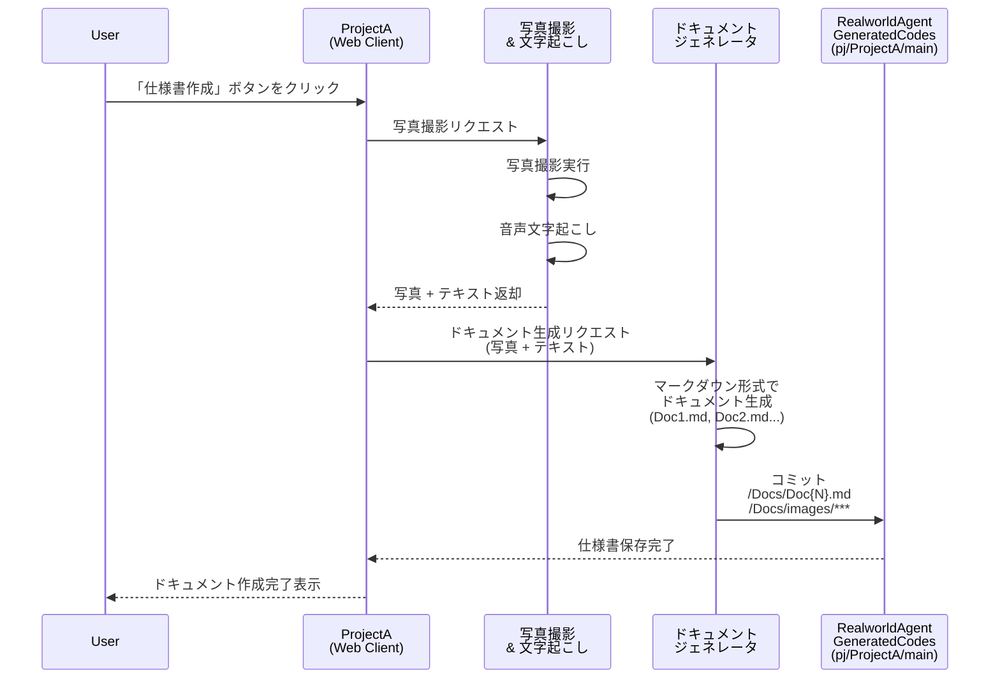
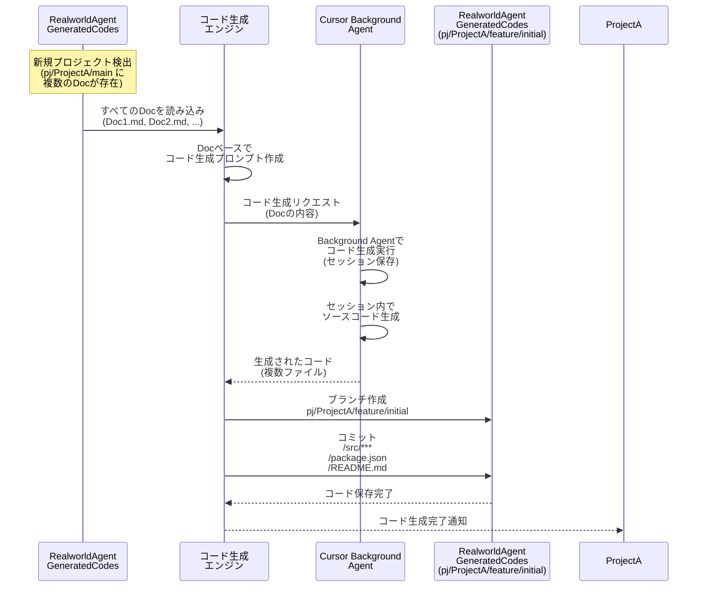
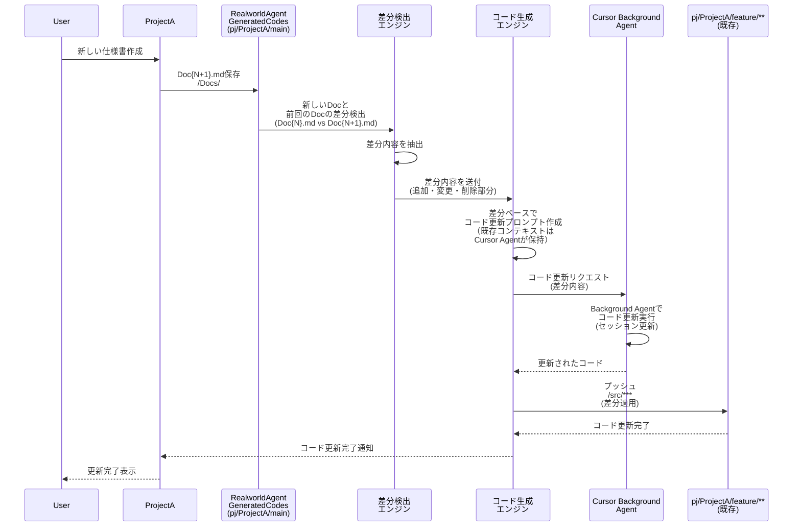
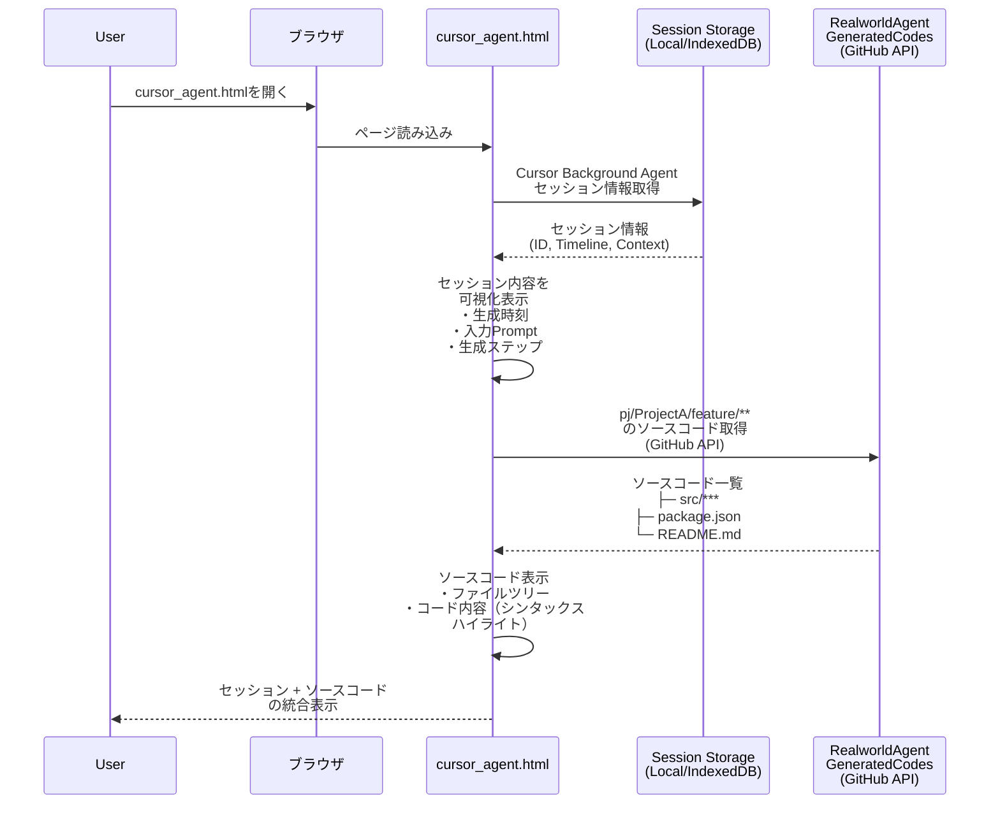
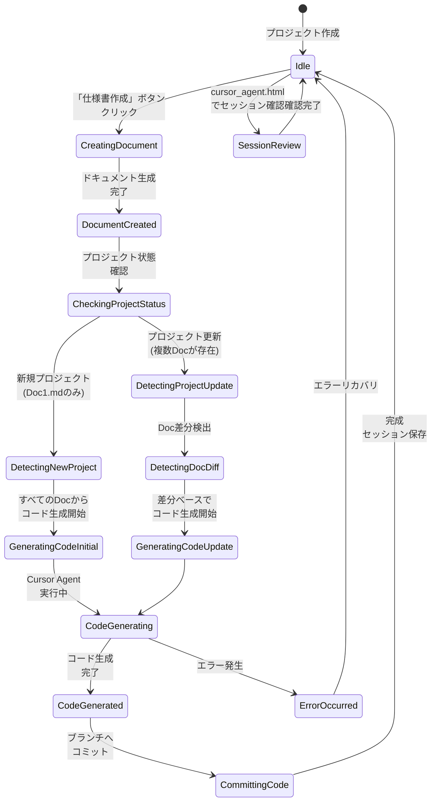
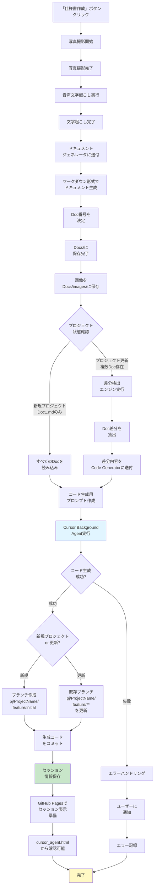

# RealworldAgent シーケンス図（更新版）

## 1. 仕様書作成フロー（ProjectA）



## 2. コード生成フロー（新規プロジェクト）



## 3. コード生成フロー（プロジェクト更新）



## 4. cursor_agent.htmlでの確認フロー



---

## フロー説明

### シーケンス1: 仕様書作成フロー
**目的**: Projectで「仕様書作成」ボタンから自動でドキュメント生成  
**主要ステップ**:
1. 写真撮影 + 文字起こし
2. ドキュメント自動生成（マークダウン形式）
3. `pj/<ProjectName>/main` ブランチの `/Docs/` に保存
4. インクリメント保存: Doc1.md, Doc2.md, Doc3.md...（競合なし）
5. 画像は `/Docs/images/` に保存

**所要時間**: 2-10秒

---

### シーケンス2: コード生成フロー（新規プロジェクト）
**目的**: 新規プロジェクトの場合、すべてのDocをベースにコード生成  
**主要ステップ**:
1. 新規プロジェクト検出（`pj/<ProjectName>/main` に複数のDoc存在）
2. すべてのDocを読み込み
3. Cursor Background Agentでコード生成実行
   - セッションはCursor Agentが保存
   - ソースコード生成
4. `pj/<ProjectName>/feature/initial` ブランチに保存
5. 生成されたコード:
   - `/src/***`
   - `/package.json`
   - `/README.md`

**特徴**:
- セッション保存により、以降の更新時にコンテキスト保持
- ソースコードはCursor Agentが管理

---

### シーケンス3: コード生成フロー（プロジェクト更新）
**目的**: 仕様書更新時に、差分をベースにコード自動更新  
**主要ステップ**:
1. 新しい仕様書作成（Doc{N+1}.md）
2. 差分検出: Doc{N}.md vs Doc{N+1}.md
3. Cursor Background Agentでコード更新
   - セッションは前回のものを継続
   - 差分のみをベースにコード更新
4. `pj/<ProjectName>/feature/**` ブランチを更新

**特徴**:
- ソースコードはCursor Agentセッション内に保持
- APIサーバー側ではDoc差分のみを管理
- コンテキスト保持により、正確な更新が可能

---

### シーケンス4: cursor_agent.htmlでの確認フロー
**目的**: Cursor Background Agentのセッション＋生成コードの統合確認  
**表示内容**:
1. **セッション情報**
   - Background Agent ID
   - セッションタイムライン
   - コンテキスト内容
   - 生成時刻

2. **ソースコード表示**
   - ファイルツリー（フォルダ構造）
   - コード内容（シンタックスハイライト付き）
   - ファイル一覧

**データ源**:
- セッション情報: Local/IndexedDB
- ソースコード: GitHub API（`pj/<ProjectName>/feature/**` ブランチ）

---

## リポジトリ構造

### RealworldAgentGeneratedCodes

```
RealworldAgentGeneratedCodes/
│
├── pj/ProjectA/
│   │
│   ├── main (branch)                        # 仕様書・ドキュメント
│   │   ├── Docs/
│   │   │   ├── Doc1.md
│   │   │   ├── Doc2.md
│   │   │   ├── Doc3.md
│   │   │   └── images/
│   │   │       ├── img1.png
│   │   │       └── img2.png
│   │   └── ...
│   │
│   └── feature/** (branches)                 # ソースコード
│       ├── feature/initial
│       │   ├── src/
│       │   ├── package.json
│       │   ├── README.md
│       │   └── tsconfig.json
│       ├── feature/v2
│       │   ├── src/
│       │   ├── package.json
│       │   └── ...
│       └── feature/v3
│           └── ...
│
├── pj/ProjectB/
│   ├── main (branch)
│   │   └── Docs/
│   │       └── Doc1.md
│   │
│   └── feature/** (branches)
│       └── feature/initial
│           └── ...
│
└── pj/ProjectC/
    ├── main (branch)
    │   └── Docs/
    │
    └── feature/** (branches)
        └── ...
```

---

## 実装チェックリスト

- [ ] 仕様書作成時のインクリメント機構（Doc{N}.mdの自動採番）
- [ ] 画像保存機構（Docs/images/への自動振り分け）
- [ ] 新規/更新の自動判定ロジック
- [ ] Doc差分検出エンジン
- [ ] Cursor Background Agent統合
- [ ] GitHub API連携（pj/<ProjectName>/feature/*** ブランチの作成・更新）
- [ ] cursor_agent.htmlの開発
  - [ ] Session Storage からセッション情報取得
  - [ ] GitHub APIでコード取得
  - [ ] 統合表示UI

---

## 5. ステートマシン図（プロジェクトライフサイクル）



---

## 6. アクティビティ図（仕様書作成〜コード生成フロー）



---

## ステートマシン図の説明

### 状態遷移

| 状態 | 説明 | 遷移先 |
|------|------|--------|
| **Idle** | 待機状態 | CreatingDocument / SessionReview |
| **CreatingDocument** | ドキュメント作成中 | DocumentCreated |
| **DocumentCreated** | ドキュメント作成完了 | CheckingProjectStatus |
| **CheckingProjectStatus** | プロジェクト状態確認 | DetectingNewProject / DetectingProjectUpdate |
| **DetectingNewProject** | 新規プロジェクト検出 | GeneratingCodeInitial |
| **DetectingProjectUpdate** | 既存プロジェクト検出 | DetectingDocDiff |
| **DetectingDocDiff** | ドキュメント差分検出 | GeneratingCodeUpdate |
| **GeneratingCodeInitial** | 新規コード生成準備 | CodeGenerating |
| **GeneratingCodeUpdate** | 更新コード生成準備 | CodeGenerating |
| **CodeGenerating** | Cursor Agent実行中 | CodeGenerated / ErrorOccurred |
| **CodeGenerated** | コード生成完了 | CommittingCode |
| **CommittingCode** | ブランチへコミット | Idle |
| **ErrorOccurred** | エラー発生 | Idle |
| **SessionReview** | cursor_agent.htmlで確認 | Idle |

### 重要な分岐点

1. **プロジェクト状態判定**
   - 新規プロジェクト: `Doc1.md` のみ存在 → すべてのDocでコード生成
   - プロジェクト更新: 複数のDoc存在 → 差分検出後にコード生成

2. **コード生成結果**
   - 成功: ブランチ作成/更新へ進む
   - 失敗: エラーハンドリング → リトライまたは通知

3. **ブランチ選択**
   - 新規: `pj/<ProjectName>/feature/initial` 作成
   - 更新: 既存の `pj/<ProjectName>/feature/**` を更新

---

## アクティビティ図の説明

### フロー構成

**フェーズ1: 入力収集（写真・文字起こし）**
- 写真撮影 → 文字起こし → ドキュメント生成 → 画像分類

**フェーズ2: プロジェクト状態判定**
- 新規 vs 更新の自動判定
- 新規の場合: すべてのDoc読み込み
- 更新の場合: Doc差分検出

**フェーズ3: コード生成実行**
- Cursor Background Agent起動
- セッション保存
- 成功/失敗判定

**フェーズ4: ブランチ操作**
- 新規プロジェクト: `pj/<ProjectName>/feature/initial` 作成
- 既存プロジェクト: 既存ブランチ更新

**フェーズ5: 完了処理**
- セッション情報保存
- cursor_agent.htmlで表示可能な状態に

### 例外処理

- **エラー発生時の処理**:
  1. エラーハンドリング実行
  2. ユーザーに通知
  3. ログに記録
  4. Idleへ戻る

### 並列処理（潜在的）

将来的には以下を並列化可能：
- 画像処理と文字起こし
- 複数ファイルのコード生成
- キャッシュ処理とDB保存
