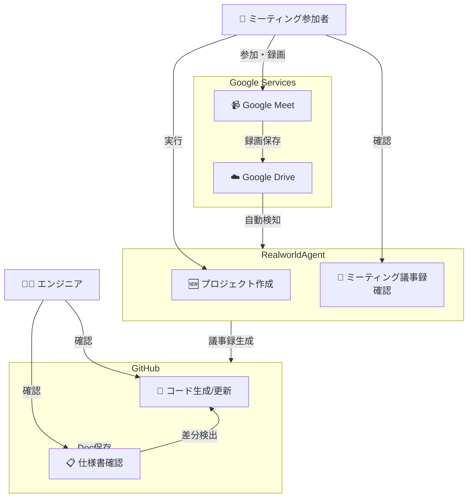
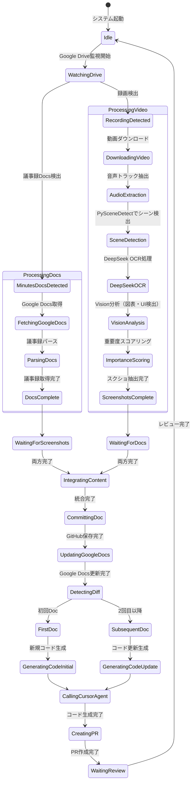
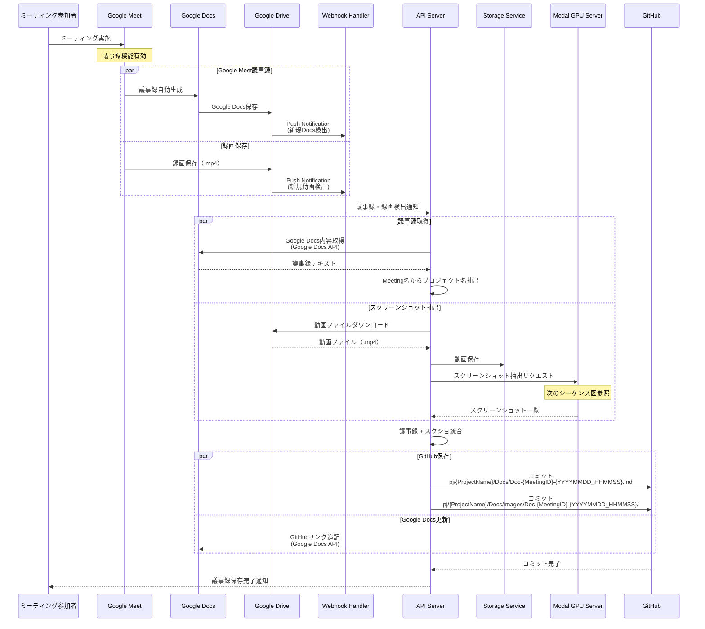
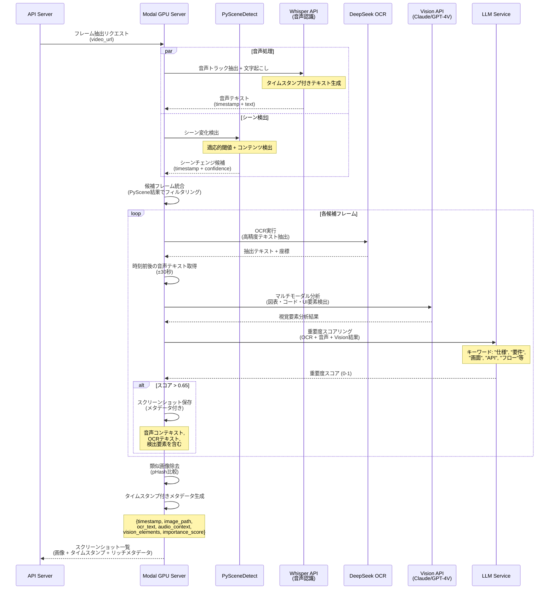
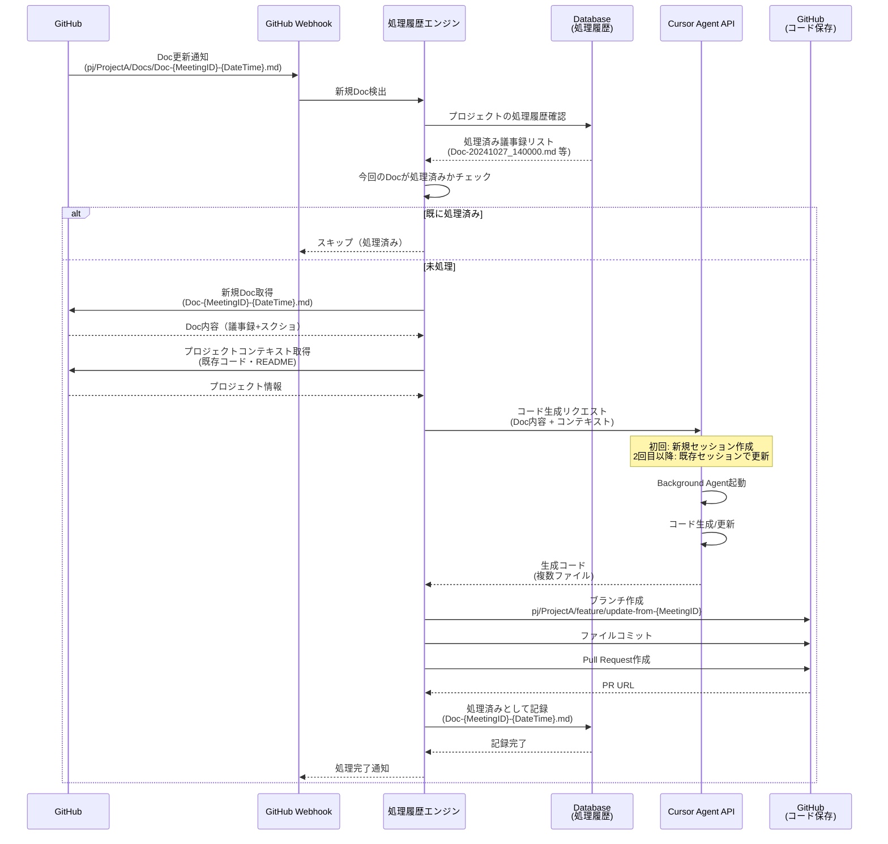
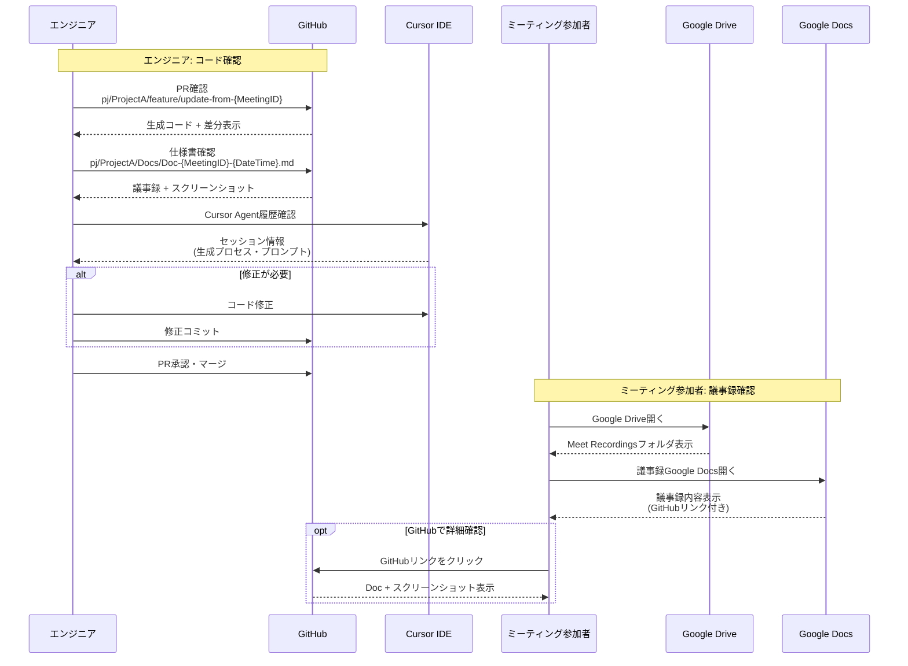
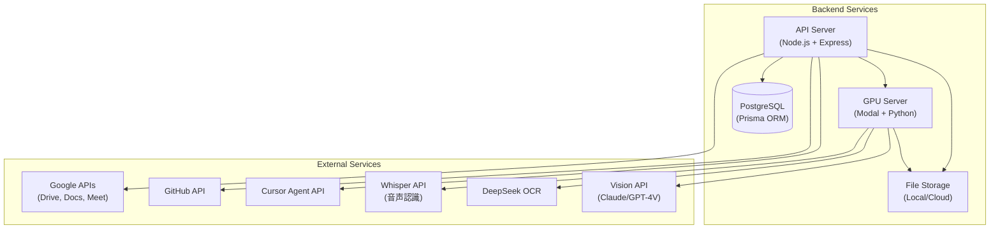
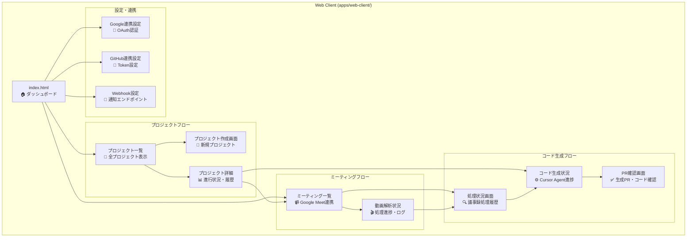
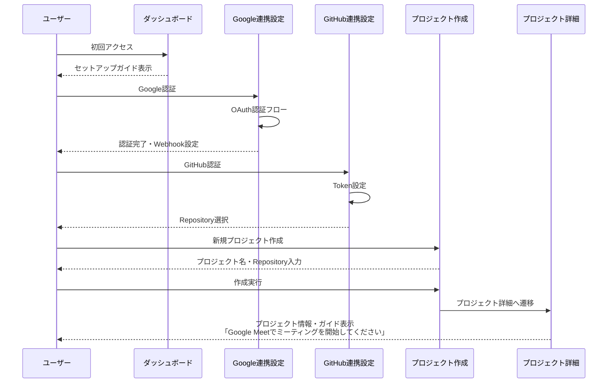
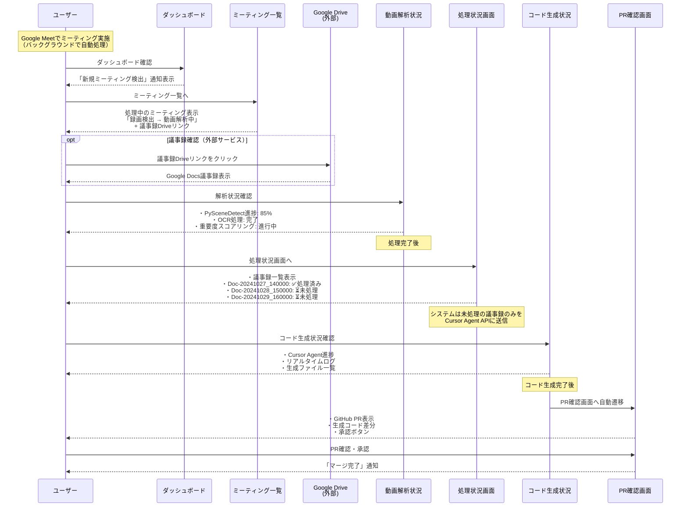

# RealworldAgent システム図

## 最終ゴール

**「ミーティングするだけで、AIが全オフィス作業を自動実行する世界」**

RealworldAgentは、Google Meetのミーティングから**意思決定・タスク・要求を自動抽出**し、**AIエージェントが人間の作業を完全自動化**するシステムです。

### 自動化される作業例
- ✅ **ソフトウェア開発**: コード生成・レビュー・デプロイ
- ✅ **営業活動**: メール送信・提案資料作成・顧客対応
- ✅ **ドキュメント作成**: 仕様書・プレゼン資料・議事録
- ✅ **プロジェクト管理**: タスク割り当て・進捗管理・レポート作成
- ✅ **データ分析**: 分析・レポート・可視化

### システムフロー概要
```
Google Meetミーティング
    ↓
【誰が・何を要求・どう決定・期限は？】を自動抽出
    ↓
AIエージェントが自動実行
    ↓
✅ コード生成完了（GitHub PR）
✅ メール送信完了
✅ 資料作成完了
✅ タスク管理完了
```

---

## 技術実装詳細（現バージョン: Google Meet録画ベース）

**現在の実装**: ミーティング録画からコード生成までを自動化

**将来の拡張**: メール送信・営業活動・タスク管理等の全オフィス作業へ展開

---

## 1. ユースケース図



---

## ユースケース図の説明

### アクター

| アクター | 説明 | 確認可能な情報 |
|---------|------|---------|
| **ミーティング参加者** | Google Meetに参加し、後でGoogle Drive上のGoogle Docsでミーティング議事録を確認できる | Google Drive（議事録・Google Docs） |
| **エンジニア** | GitHub経由でコードや仕様書の情報を確認・管理 | GitHub（仕様書・コード） |

---

### ユースケース一覧

| # | ユースケース | 説明 | アクター | 場所 |
|----|------------|------|---------|------|
| 1 | **プロジェクト作成** | 新しいプロジェクトを作成 | ミーティング参加者 | RealworldAgent |
| 2 | **Google Meet録画** | Google Meetでミーティング実施・録画 | ミーティング参加者 | Google Meet |
| 3 | **録画自動検知** | Google Driveに保存された録画を自動検知 | システム | Google Drive → RealworldAgent |
| 4 | **議事録取得・要求抽出** | Google Meet標準機能で生成された議事録をGoogle Docsから取得し、「誰が・何を要求・どう決定」を抽出（将来実装） | システム | RealworldAgent |
| 5 | **コード生成/更新** | 仕様書をベースにコード生成（初回）または更新（既存） | システム | GitHub |
| 6 | **仕様書確認** | GitHub内で仕様書を確認 | エンジニア | GitHub |
| 7 | **ミーティング議事録確認** | Google Drive上のGoogle Docsで議事録を確認 | ミーティング参加者 | Google Drive |

---

### ユースケース間の関係

**ユースケース遷移**:
```
ミーティング参加者
    ↓
[Google Meet録画]
    ↓
[Google Drive保存]
    ↓
[RealworldAgent自動検知]
    ↓
[議事録生成] → GitHub保存
    ↓
[仕様書確認] (エンジニア)
    ↓
[コード生成/更新] (Cursor Agent)
    
議事録確認 ← RealworldAgent
(ミーティング参加者)
```

- **Google Meet録画**: ミーティング参加者がGoogle Meetでミーティング実施・録画
- **Google Drive保存**: 録画が自動的にGoogle Driveに保存
- **録画自動検知**: RealworldAgentがGoogle Drive Webhookで録画を検知
- **議事録生成**: 音声・映像解析→議事録生成→GitHub保存
- **仕様書確認**: エンジニアが GitHub 内で確認（議事録 + スクリーンショット）
- **コード生成/更新**: 仕様書をベースに、初回はコード生成、2回目以降は差分を検出してコード更新
- **ミーティング議事録確認**: ミーティング参加者がGoogle Drive上のGoogle Docsで議事録を後で確認

---

## 2. ステートマシン図（システムライフサイクル）



---

## ステートマシン図の説明

### 状態遷移

| 状態 | 説明 | 遷移先 |
|------|------|--------|
| **Idle** | 待機状態 | WatchingDrive |
| **WatchingDrive** | Google Drive監視中 | MinutesDocsDetected / RecordingDetected |
| **MinutesDocsDetected** | 議事録Docs検出 | FetchingGoogleDocs |
| **FetchingGoogleDocs** | Google Docs取得中 | ParsingDocs |
| **ParsingDocs** | 議事録パース中 | DocsComplete |
| **DocsComplete** | 議事録取得完了 | WaitingForScreenshots |
| **RecordingDetected** | 録画検出 | DownloadingVideo |
| **DownloadingVideo** | 動画ダウンロード中 | AudioExtraction |
| **AudioExtraction** | 音声トラック抽出中 | SceneDetection |
| **SceneDetection** | PySceneDetectシーン検出中 | DeepSeekOCR |
| **DeepSeekOCR** | DeepSeek OCR処理中 | VisionAnalysis |
| **VisionAnalysis** | Vision分析中（図表・UI検出） | ImportanceScoring |
| **ImportanceScoring** | 重要度スコアリング中 | ScreenshotsComplete |
| **ScreenshotsComplete** | スクショ抽出完了 | WaitingForDocs |
| **WaitingForScreenshots** | スクショ待機中（Docs完了済み） | IntegratingContent |
| **WaitingForDocs** | Docs待機中（スクショ完了済み） | IntegratingContent |
| **IntegratingContent** | 議事録+スクショ統合中 | CommittingDoc |
| **CommittingDoc** | GitHub保存中 | UpdatingGoogleDocs |
| **UpdatingGoogleDocs** | Google Docs更新中 | DetectingDiff |
| **DetectingDiff** | Doc差分検出・判定 | FirstDoc / SubsequentDoc |
| **FirstDoc** | 初回Doc判定 | GeneratingCodeInitial |
| **SubsequentDoc** | 2回目以降Doc判定 | GeneratingCodeUpdate |
| **GeneratingCodeInitial** | 新規コード生成準備 | CallingCursorAgent |
| **GeneratingCodeUpdate** | 更新コード生成準備 | CallingCursorAgent |
| **CallingCursorAgent** | Cursor Agent API実行中 | CreatingPR |
| **CreatingPR** | PR作成中 | WaitingReview |
| **WaitingReview** | レビュー待ち | Idle |

### 重要な分岐点

1. **並列検出（WatchingDrive）**
   - 議事録Docs検出: Google Docs取得フロー開始
   - 録画検出: スクリーンショット抽出フロー開始
   - 両方が完了するまで待機

2. **並列処理の同期**
   - ProcessingDocs: Google Docs → パース → 完了
   - ProcessingVideo: 
     - 動画DL → 音声トラック抽出（Whisper API）
     - PySceneDetectでシーン検出
     - DeepSeek OCRでテキスト抽出
     - Vision APIで図表・UI検出
     - 重要度スコアリング → 完了
   - 両方完了後にコンテンツ統合へ

3. **Doc判定**
   - 初回Doc: すべての内容でコード生成
   - 2回目以降: 差分検出後にコード更新

---

## 3. Google Meet議事録取得 → GitHub保存フロー



---

## 4. 動画からスクリーンショット自動抽出フロー（改善版）



---

## 5. 議事録処理履歴管理 → Cursor Agent連携フロー



---

## 6. エンジニアとミーティング参加者による確認フロー



---

## フロー説明

### シーケンス3: Google Meet議事録取得からGitHub保存までの全体フロー
**目的**: Google Meet議事録とスクリーンショットを自動取得してGitHub保存  
**主要ステップ**:
1. Google Meetミーティング実施（議事録機能有効）
2. 並列生成:
   - Google Meetが議事録を自動生成 → Google Docsとして保存
   - 録画も自動保存（スクリーンショット用）
3. Google DriveのWebhookで新規Docs・録画を検出
4. 並列処理:
   - Google Docs APIで議事録テキスト取得
   - 録画からスクリーンショット自動抽出
5. Meeting名からプロジェクト名を自動抽出
6. 議事録とスクリーンショットを統合
7. GitHub に保存: `pj/{ProjectName}/Docs/Doc-{MeetingID}-{YYYYMMDD_HHMMSS}.md` + `images/Doc-{MeetingID}-{YYYYMMDD_HHMMSS}/`
8. Google DocsにGitHubリンクを追記

**所要時間**: 3-10分（録画の長さに依存）

**特徴**:
- Google Meet標準の議事録機能を活用（高精度）
- Google DocsとGitHubの両方に保存（バックアップ）
- スクリーンショットで視覚情報を補完

---

### シーケンス4: 動画解析とスクリーンショット自動抽出の詳細（改善版）
**目的**: 動画から仕様書に適したスクリーンショットを自動抽出し、音声コンテキストと紐付け  

**主要ステップ**:
1. **並列処理開始**:
   - **音声処理**: Whisper APIで音声トラックを文字起こし（タイムスタンプ付き）
   - **シーン検出**: PySceneDetectで適応的閾値によるシーン変化検出（固定間隔ではない）
2. **候補フレーム統合**: PySceneDetectの結果でフレームをフィルタリング（不要フレーム削減）
3. **マルチモーダル解析**（各候補フレームに対して）:
   - **DeepSeek OCR**: 高精度テキスト抽出（座標付き）
   - **音声コンテキスト取得**: フレーム時刻の前後±30秒の音声テキスト
   - **Vision API分析**: 図表・コード・UI要素・ホワイトボードの検出
4. **LLMによる重要度スコアリング**:
   - 入力: OCRテキスト + 音声コンテキスト + Vision分析結果
   - キーワード重み付け: "仕様", "要件", "画面", "API", "フロー", "設計" 等
   - スコア閾値: 0.65以上を保存
5. **類似画像除去**: pHash（知覚ハッシュ）で重複スクリーンショット削除
6. **リッチメタデータ付きで保存**:
   - 画像ファイル、タイムスタンプ、OCRテキスト、音声コンテキスト、検出要素リスト、重要度スコア

**技術選定の理由**:

**PySceneDetect vs OpenCV-CUDA ヒストグラム比較**:
- ✅ **推奨: PySceneDetect**
  - 適応的閾値で動画特性に自動対応
  - コンテンツベースの検出でより高精度
  - 会議動画に最適化した閾値設定が容易（threshold=27-30）
  - 候補フレーム数を大幅削減（1/3〜1/5）
- ❌ OpenCV-CUDA ヒストグラム比較
  - 固定閾値で調整が必要
  - シンプルなヒストグラム比較で誤検出が多い
  - ただし、GPU並列処理が必要な場合は選択肢

**フレーム抽出間隔**:
- ❌ **固定5秒間隔は非推奨**
  - 重要なシーンを見逃す可能性
  - 不要なフレームも大量に抽出
- ✅ **PySceneDetectの適応的検出を推奨**
  - シーン変化を自動検出（間隔は可変）
  - 会議動画では平均10-20秒に1回程度のシーン変化
  - 処理効率が大幅に向上

**特徴**:
- PySceneDetectで賢くフィルタリング（固定間隔より効率的）
- DeepSeek OCRで高精度テキスト抽出
- マルチモーダル（画像 + 音声 + テキスト）で高精度判定
- 音声コンテキストで文脈を保持

---

### シーケンス5: 議事録処理履歴管理からコード生成までの自動化フロー
**目的**: 議事録更新を検知し、**未処理の議事録のみ**を自動でコード生成  
**主要ステップ**:
1. GitHub WebhookでDoc更新を検知
2. **処理履歴チェック**: データベースで処理済み議事録リストを確認
   - 例: `Doc-20241027_140000.md`, `Doc-20241028_150000.md` が処理済み
3. **今回のDocが処理済みか判定**:
   - **処理済みの場合**: スキップ（Cursor Agent APIに送信しない）
   - **未処理の場合**: 以下の処理を実行
4. 新規Doc取得（議事録+スクリーンショット）
5. プロジェクトコンテキスト取得（既存コード・README）
6. **Cursor Agent Background APIでコード生成/更新**:
   - **初回**: 新規セッション作成 → Background Agent起動 → コード生成 → **セッションID保存**
   - **2回目以降**: 前回の**セッションID**を使用 → 既存セッション内でコード更新生成
   - セッション内でプロジェクトコンテキストを保持（効率的）
7. GitHubにブランチ作成・コミット・PR作成
8. **処理済みとしてDB記録**: `Doc-{MeetingID}-{DateTime}.md`を処理済みリストに追加

**処理履歴データ構造**:
```json
{
  "project_id": "project_abc123",
  "project_name": "ProjectA",
  "cursor_session_id": "session_abc123xyz",
  "processed_documents": [
    {
      "doc_filename": "Doc-meet_abc123-20241027_140000.md",
      "processed_at": "2024-10-27T14:05:00Z",
      "pr_url": "https://github.com/org/ProjectA/pull/123"
    },
    {
      "doc_filename": "Doc-meet_def456-20241028_150000.md",
      "processed_at": "2024-10-28T15:08:00Z",
      "pr_url": "https://github.com/org/ProjectA/pull/124"
    }
  ]
}
```

**特徴**:
- **処理済み議事録はスキップ**: 日時Aが処理済みなら、日時Bのみを処理
- **重複処理を防止**: 同じ議事録を複数回Cursor Agent APIに送信しない
- **処理履歴を永続化**: データベースで処理済みリストを管理
- **初回/2回目以降を自動判定**: 処理履歴の有無でセッション管理
- **セッションIDを再利用**: 前回のセッション内でコード更新を継続的に生成
- 自動でPR作成まで完了

---

### シーケンス6: エンジニアとミーティング参加者による確認フロー
**目的**: エンジニアとミーティング参加者がそれぞれの視点で確認  
**主要ステップ**:

**エンジニア側**:
1. GitHubでPR確認（生成コード + 差分）
2. 仕様書確認（議事録 + スクリーンショット）
3. Cursor IDEでAgent履歴確認（生成プロセス）
4. 必要に応じて修正
5. PR承認・マージ

**ミーティング参加者側**:
1. Google Driveで「Meet Recordings」フォルダを開く
2. 議事録Google Docsを開く
3. 議事録内容確認（GitHubリンク付き）
4. 必要に応じてGitHubリンクからスクリーンショット含む詳細版を確認

**特徴**:
- エンジニアはGitHub/Cursor経由（コード中心）
- ミーティング参加者はGoogle Drive経由（議事録中心）
- Google DocsにGitHubリンクがあり、詳細確認も可能
- 役割に応じた確認フロー

---

## システム全体の特徴

### 現バージョンの自動化範囲（v1.0）
**実装済み**: Google Meetミーティング → 議事録・スクショ抽出 → コード生成

### 自動化されたワークフロー
1. **Google Meet議事録機能活用**: 標準機能で高精度な議事録を自動生成
2. **Google Docs + GitHub二重保存**: Google DocsとGitHubの両方に保存してバックアップ
3. **並列処理**: 議事録取得とスクリーンショット抽出を同時処理して効率化
4. **スマートなスクリーンショット抽出**: Vision APIとOCRで重要なフレームのみを自動選別
5. **差分ベースのコード更新**: 変更箇所のみをCursor Agentに送信
6. **Google Docs自動更新**: GitHubリンクを議事録に追記して連携

### データフロー
```
Google Meet会議
  ├─ 議事録機能（Google Docs自動生成）
  └─ 録画保存
      ↓
Google Drive保存（Docs + 録画）
      ↓
RealworldAgent検知（Webhook）
      ↓
並列処理
  ├─ Google Docs取得
  └─ スクリーンショット抽出
      ├─ PySceneDetect（シーン検出）
      ├─ Whisper API（音声認識）
      ├─ DeepSeek OCR（テキスト抽出）
      ├─ Vision API（視覚分析）
      └─ マルチモーダルLLM（重要度判定）
      ↓
議事録 + スクショ統合
      ↓
GitHub保存（pj/{ProjectName}/Docs/Doc-{MeetingID}-{DateTime}.md）
  + 画像保存（images/Doc-{MeetingID}-{DateTime}/）
  + Google Docs更新（GitHubリンク追記）
      ↓
Doc差分検出
      ↓
Cursor Agent（コード生成/更新）
      ↓
GitHub PR作成（pj/{ProjectName}/feature/）
```

### 役割分担
- **ミーティング参加者**: Google Meetでミーティング実施、後でGoogle Drive上のGoogle Docsで議事録確認
- **エンジニア**: GitHub/Cursorでコード確認・仕様書確認、PR承認
- **システム**: 完全自動処理（議事録検知→GitHub保存→コード生成）

### Google連携の特徴
- **Google Meet議事録**: 標準機能で高精度、今後さらに精度向上
- **Google Docs**: 議事録の一次保存先、GitHubリンクで連携
- **Google Drive**: Webhook通知で即座に検知
- **双方向同期**: Google Docs ⇔ GitHub の相互参照可能

---

## 将来の拡張計画（Full Version）

### フェーズ2: 意思決定・タスク抽出エンジン
**目的**: ミーティングから「誰が・何を要求・どう決定・期限」を自動抽出

**実装予定**:
1. **要求者識別**: 話者分離 + 発話内容から要求者を特定
2. **決定事項抽出**: 「〜することに決定」「〜で進めます」を検出
3. **期限推論**: 「来週まで」「月末まで」を具体的日付に変換
4. **作業分類**: 開発 / メール / 資料作成 / 管理業務 に自動分類

**抽出データ構造例**:
```json
{
  "meeting_id": "meet_abc123",
  "decisions": [
    {
      "time": "00:12:34",
      "requester": "田中さん (営業)",
      "content": "ログイン機能を来週までに実装してほしい",
      "decision": "承認 - エンジニアが対応",
      "deadline": "2024-11-03",
      "priority": "high",
      "task_type": "software_development"
    }
  ]
}
```

### フェーズ3: AIエージェント自動実行
**目的**: 抽出されたタスクをAIエージェントが自動実行

**実装予定エージェント**:

| エージェント | 役割 | 自動化される作業 |
|------------|------|----------------|
| **コード開発エージェント** | ソフトウェア開発 | コード生成・PR作成・テスト・デプロイ |
| **メールエージェント** | 営業・連絡 | メール文面生成・送信・フォローアップ |
| **ドキュメント作成エージェント** | 資料作成 | 仕様書・提案資料・プレゼン資料・レポート |
| **タスク管理エージェント** | プロジェクト管理 | タスク割り当て・進捗管理・リスク検出・レポート |

**実行フロー例**:
```
ミーティング終了
    ↓
タスク抽出完了（3分後）
    ↓
並列実行:
  ├─ CodeAgent: ログイン機能実装 → GitHub PR作成
  ├─ EmailAgent: A社へ報告メール送信
  ├─ DocAgent: API仕様書作成
  └─ TaskAgent: タスク管理・進捗レポート
    ↓
全作業完了（数時間後）
    ↓
Slack通知: 「全タスク完了しました🎉」
```

### フェーズ4: 完全自動化オフィス
**目標**: 人間は意思決定と承認のみ、実行はすべてAI

**実装予定機能**:
- 📧 **自動営業**: CRM連携・顧客分析・提案資料作成・商談スケジューリング
- 📊 **自動分析**: データ収集・分析・可視化・レポート作成
- 🤖 **マルチエージェント協調**: エージェント間の自動連携・最適スケジューリング
- ⚠️ **リスク検出**: 納期遅延・予算超過の自動警告・代替案提示
- 📝 **自動見積**: 要求から自動見積書・契約書作成

### ロードマップ
```
v1.0 (現在) ✅
  └─ Google Meet → 議事録・スクショ → コード生成

v2.0 (次期)
  └─ 意思決定・タスク抽出エンジン追加

v3.0
  └─ AIエージェント自動実行（メール・資料作成・タスク管理）

v4.0 (最終形)
  └─ 完全自動化オフィス（営業・分析・全業務自動化）
```

**最終ゴール達成時の世界**:
- エンジニアがコードを書く必要なし
- 営業がメールを書く必要なし
- PMがタスクを管理する必要なし
- **人間は意思決定と承認だけ、実行はすべてAI**

これがRealworldAgentの目指す未来です。

---

## 7. Webアプリケーション構成

### バックエンド構成

RealworldAgentのバックエンドは3つの主要サービスで構成されています。



**API Server** (`services/api-server/`):
- Express.js + TypeScript
- PostgreSQL (Prisma ORM)
- REST API エンドポイント提供
- Google Drive Webhook受信
- GitHub Webhook受信

**GPU Server** (`services/gpu-server/`):
- Modal.com でホスティング
- Python + PySceneDetect
- 動画処理・スクリーンショット抽出
- マルチモーダルAI処理

**データベース** (PostgreSQL):
```prisma
model Project {
  id                String      @id @default(uuid())
  name              String
  description       String?
  cursorSessionId   String?     // Cursor Agent セッションID
  repositoryUrl     String
  documents         Document[]
  processingHistory ProcessingHistory[]
  createdAt         DateTime    @default(now())
}

model Document {
  id                String               @id @default(uuid())
  projectId         String
  meetingId         String
  filename          String               // Doc-{MeetingID}-{DateTime}.md
  googleDriveUrl    String               // Google Drive議事録URL
  githubUrl         String               // GitHub Doc URL
  screenshotUrls    Json                 // スクリーンショットURL配列
  processingStatus  String               // pending/processing/processed/skipped
  createdAt         DateTime             @default(now())
  project           Project              @relation(fields: [projectId], references: [id])
  processingHistory ProcessingHistory[]
}

model ProcessingHistory {
  id          String   @id @default(uuid())
  projectId   String
  documentId  String
  status      String   // processed/skipped
  prUrl       String?  // GitHub PR URL
  processedAt DateTime @default(now())
  project     Project  @relation(fields: [projectId], references: [id])
  document    Document @relation(fields: [documentId], references: [id])
}
```

---

### フロントエンド構成（設計）

RealworldAgentのフロントエンドは、**Google Meetミーティング → 議事録・コード生成までの自動化フロー**を視覚化・管理する**最小限のインターフェース**です。

**設計方針**:
- 外部サービス（Google Drive、GitHub）で賄えるものは外部リンクのみ提供
- 自動化フローの**進捗状況・ステータス監視**に特化
- 設定・連携管理を簡潔に



---

### フロントエンドページ詳細（設計）

| ページ | 説明 | 主要機能 | 連携 |
|--------|------|---------|------|
| **ダッシュボード** | システム全体の概要表示 | ・最近のミーティング<br/>・進行中のコード生成<br/>・通知一覧 | API Server |
| **プロジェクト作成** | 新規プロジェクト登録 | ・プロジェクト名入力<br/>・GitHub Repository設定<br/>・初期設定 | GitHub API |
| **プロジェクト一覧** | 全プロジェクト管理 | ・プロジェクト検索<br/>・ステータス表示<br/>・削除・編集 | API Server |
| **プロジェクト詳細** | プロジェクト進行状況 | ・議事録履歴（Google Driveリンク）<br/>・生成コード履歴<br/>・Cursor Agentセッション情報 | API Server + GitHub |
| **ミーティング一覧** | Google Meet録画一覧 | ・Google Drive連携<br/>・録画検出状況<br/>・処理ステータス<br/>・議事録へのDriveリンク | Google Drive API |
| **動画解析状況** | スクリーンショット抽出進捗 | ・PySceneDetect進捗<br/>・OCR処理状況<br/>・重要度スコア一覧<br/>・エラーログ | GPU Server |
| **処理状況画面** | 議事録処理履歴管理 | ・処理済み議事録一覧<br/>・未処理議事録一覧<br/>・処理日時・セッションID<br/>・スキップ/処理ボタン | API Server |
| **コード生成状況** | Cursor Agent実行進捗 | ・Background API進捗<br/>・リアルタイムログ<br/>・生成ファイル一覧 | Cursor Agent API |
| **PR確認画面** | 生成されたPRの確認 | ・GitHub PR表示<br/>・差分確認<br/>・承認・却下 | GitHub API |
| **Google連携設定** | Google OAuth設定 | ・認証フロー<br/>・Drive Webhook設定<br/>・権限管理 | Google OAuth |
| **GitHub連携設定** | GitHub Token設定 | ・Personal Access Token<br/>・Repository選択<br/>・Webhook設定 | GitHub OAuth |
| **Webhook設定** | 通知エンドポイント管理 | ・Google Drive Webhook URL<br/>・GitHub Webhook URL<br/>・Secret設定 | API Server |

---

### フロントエンド技術スタック

**開発環境**:
- Vite (ビルドツール)
- TypeScript
- HTML5 + CSS3

**主要ライブラリ**:
```json
{
  "dependencies": {
    "axios": "HTTP通信",
    "marked": "Markdown表示",
    "highlight.js": "シンタックスハイライト"
  }
}
```

**共通スタイル** (`styles.css`):
- モダンなダークテーマUI
- レスポンシブデザイン
- カード型レイアウト

**共通ロジック** (`app.ts`):
- API通信処理
- 認証・セッション管理
- エラーハンドリング

---

### フロントエンドユーザーフロー（設計）

**シナリオ1: 初回プロジェクトセットアップ**



**シナリオ2: ミーティング → コード生成までの自動フロー確認**



---

### デプロイ構成

**開発環境**:
```bash
# API Server
cd services/api-server
npm run dev  # http://localhost:3000

# Web Client
cd apps/web-client
npm run dev  # http://localhost:5173

# GPU Server (Modal)
cd services/gpu-server
modal serve modal_app.py
```

**本番環境**:
```
Frontend (Web Client)
  └─ Vercel / Netlify
      └─ Static Site Hosting

Backend (API Server)
  └─ Railway / Render
      └─ Node.js Server
      └─ PostgreSQL Database

GPU Server
  └─ Modal.com
      └─ Serverless Python Functions
```

---
