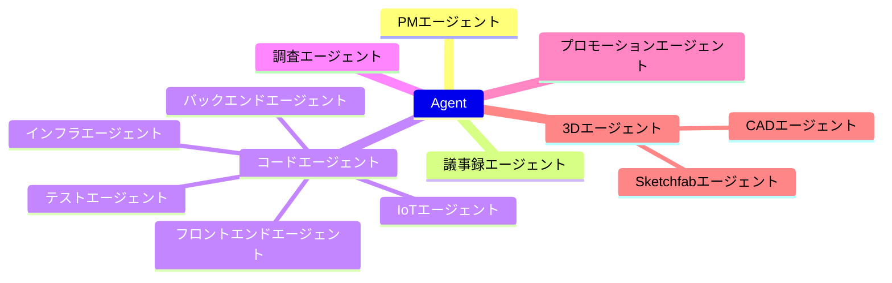
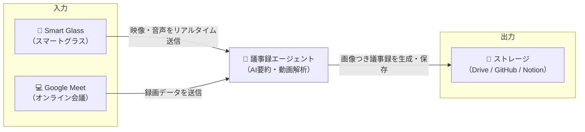
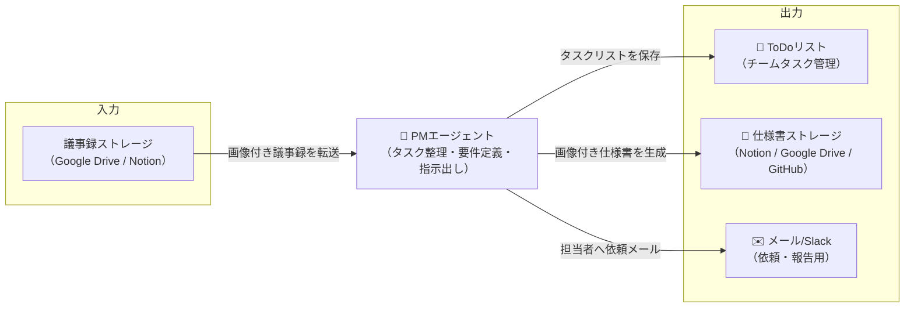
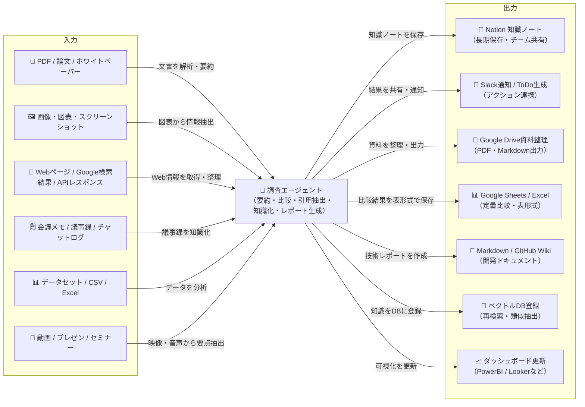

# エージェント

```mermaid
mindmap
  Agent
    PMエージェント
    議事録エージェント
    コードエージェント
      フロントエンドエージェント
      バックエンドエージェント
      テストエージェント
      インフラエージェント
      IoTエージェント
    調査エージェント
    プロモーションエージェント
    3Dエージェント
      CADエージェント
      Sketchfabエージェント
```

## 議事録エージェント

```mermaid
flowchart LR
    subgraph Input["入力"]
        SG[🎥 Smart Glass<br/>（スマートグラス）]
        GM[💻 Google Meet<br/>（オンライン会議）]
    end

    API[🤖 議事録エージェント<br/>（AI要約・動画解析）]

    subgraph Output["出力"]
        Storage[📂 ストレージ<br/>（Drive / GitHub / Notion）]
    end

    %% 動作（矢印上に記載）
    SG -->|"映像・音声をリアルタイム送信"| API
    GM -->|"録画データを送信"| API
    API -->|"画像つき議事録を生成・保存"| Storage

```

## PMエージェント

```mermaid
flowchart LR
    %% --- 入力 ---
    subgraph Input["入力"]
        G[議事録ストレージ<br/>（Google Drive / Notion）]
    end

    %% --- 中央処理 ---
    MA[🤖 PMエージェント<br/>（タスク整理・要件定義・指示出し）]

    %% --- 出力 ---
    subgraph Output["出力"]
        TODO[📝 ToDoリスト<br/>（チームタスク管理）]
        SPEC[📄 仕様書ストレージ（Notion / Google Drive / GitHub）]
        MAIL[✉️ メール/Slack<br/>（依頼・報告用）]
    end

    %% --- 矢印上に動作を明記 ---
    G -->|"画像付き議事録を転送"| MA
    MA -->|"タスクリストを保存"| TODO
    MA -->|"画像付き仕様書を生成"| SPEC
    MA -->|"担当者へ依頼メール"| MAIL
```

## 調査エージェント

```mermaid
flowchart LR
    %% --- 入力 ---
    subgraph Input["入力"]
        DOC[📄 PDF / 論文 / ホワイトペーパー]
        IMG[🖼️ 画像・図表・スクリーンショット]
        LINK[🔗 Webページ / Google検索結果 / APIレスポンス]
        NOTE[🗒️ 会議メモ / 議事録 / チャットログ]
        DATA[📊 データセット / CSV / Excel]
        VIDEO[🎥 動画 / プレゼン / セミナー]
    end

    %% --- 中央処理 ---
    RA[🧠 調査エージェント<br/>（要約・比較・引用抽出・知識化・レポート生成）]

    %% --- 出力 ---
    subgraph Output["出力"]
        NOTION[📘 Notion 知識ノート<br/>（長期保存・チーム共有）]
        SLACK[💬 Slack通知 / ToDo生成<br/>（アクション連携）]
        DRIVE[📂 Google Drive資料整理<br/>（PDF・Markdown出力）]
        SHEET[📊 Google Sheets / Excel<br/>（定量比較・表形式）]
        MD[🧾 Markdown / GitHub Wiki<br/>（開発ドキュメント）]
        DB[🧠 ベクトルDB登録<br/>（再検索・類似抽出）]
        DASH[📈 ダッシュボード更新<br/>（PowerBI / Lookerなど）]
    end

    %% --- 矢印（動作） ---
    DOC -->|"文書を解析・要約"| RA
    IMG -->|"図表から情報抽出"| RA
    LINK -->|"Web情報を取得・整理"| RA
    NOTE -->|"議事録を知識化"| RA
    DATA -->|"データを分析"| RA
    VIDEO -->|"映像・音声から要点抽出"| RA

    RA -->|"知識ノートを保存"| NOTION
    RA -->|"結果を共有・通知"| SLACK
    RA -->|"資料を整理・出力"| DRIVE
    RA -->|"比較結果を表形式で保存"| SHEET
    RA -->|"技術レポートを作成"| MD
    RA -->|"知識をDBに登録"| DB
    RA -->|"可視化を更新"| DASH
```