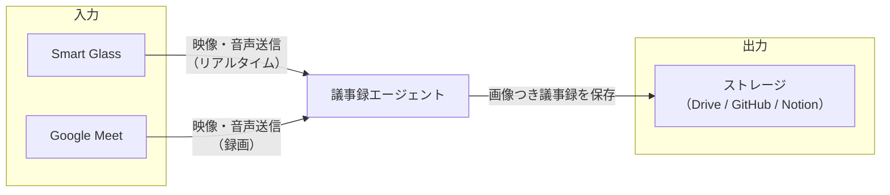

```mermaid
flowchart LR
    subgraph Input["入力"]
        SG[Smart Glass]
        GM[Google Meet]
    end

    API[議事録エージェント]

    subgraph Output["出力"]
        Storage[ストレージ<br/>（Drive / GitHub / Notion）]
    end

    SG -->|"映像・音声送信<br/>（リアルタイム）"| API
    GM -->|"映像・音声送信<br/>（録画）"| API
    API -->|"画像つき議事録を保存"| Storage
```