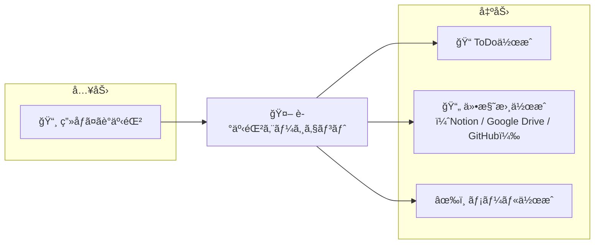

```mermaid
flowchart LR
    subgraph Input["入力"]
        G[📸 ç”»åƒã¤ã議事録]
    end

        MA[🤖 議事録エージェント]

    subgraph Output["出力"]
        TODO[📠ToDo作æˆ]
        SPEC[📄 仕様書作æˆ<br/>（Notion / Google Drive / GitHub）]
        MAIL[âœ‰ï¸ ãƒ¡ãƒ¼ãƒ«ä½œæˆ]
    end

    G --> MA
    MA --> TODO
    MA --> SPEC
    MA --> MAIL
```