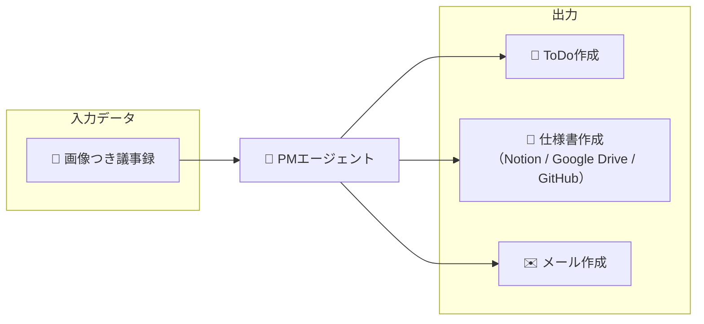

```mermaid
flowchart LR
    subgraph Input["入力データ"]
        G[📸 画像つき議事録]
    end

    MA[🤖 PMエージェント]

    subgraph Output["出力"]
        TODO[📝 ToDo作成]
        SPEC[📄 仕様書作成<br/>（Notion / Google Drive / GitHub）]
        MAIL[✉️ メール作成]
    end

    G --> MA
    MA --> TODO
    MA --> SPEC
    MA --> MAIL
```