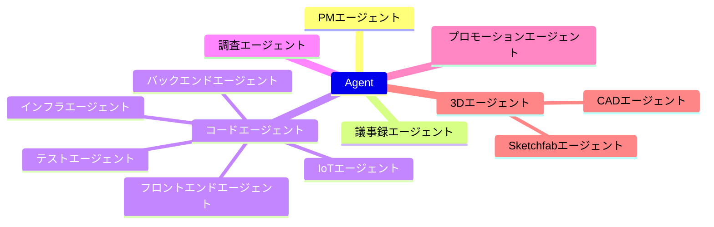
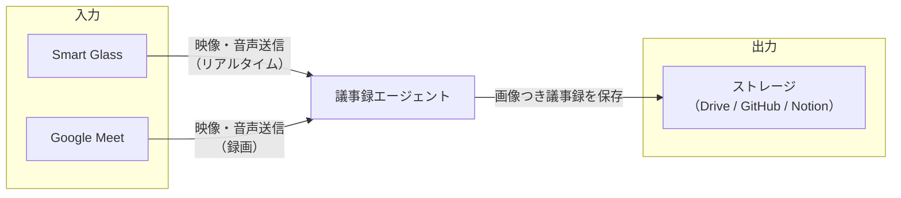
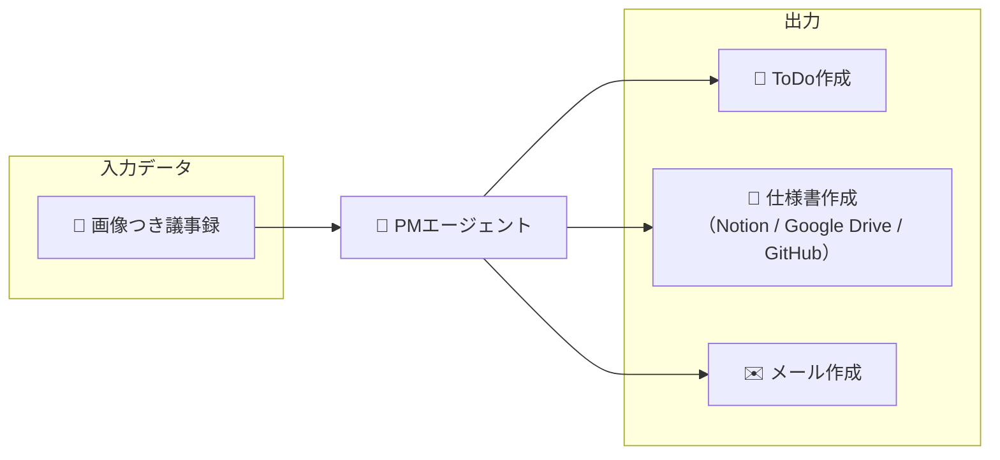
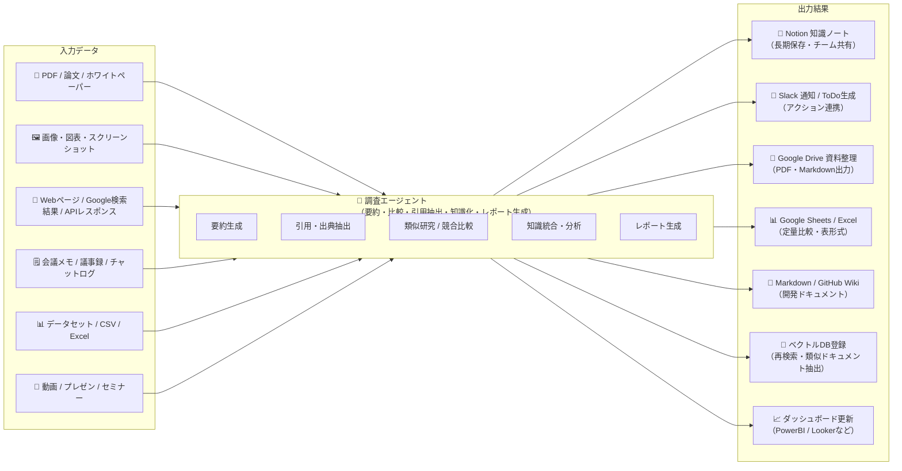

# エージェント

```mermaid
mindmap
  Agent
    PMエージェント
    議事録エージェント
    コードエージェント
      フロントエンドエージェント
      バックエンドエージェント
      テストエージェント
      インフラエージェント
      IoTエージェント
    調査エージェント
    プロモーションエージェント
    3Dエージェント
      CADエージェント
      Sketchfabエージェント
```

## 議事録エージェント

```mermaid
flowchart LR
    subgraph Input["入力"]
        SG[Smart Glass]
        GM[Google Meet]
    end

    API[議事録エージェント]

    subgraph Output["出力"]
        Storage[ストレージ<br/>（Drive / GitHub / Notion）]
    end

    SG -->|"映像・音声送信<br/>（リアルタイム）"| API
    GM -->|"映像・音声送信<br/>（録画）"| API
    API -->|"画像つき議事録を保存"| Storage
```

## PMエージェント

```mermaid
flowchart LR
    subgraph Input["入力データ"]
        G[📸 画像つき議事録]
    end

    MA[🤖 PMエージェント]

    subgraph Output["出力"]
        TODO[📝 ToDo作成]
        SPEC[📄 仕様書作成<br/>（Notion / Google Drive / GitHub）]
        MAIL[✉️ メール作成]
    end

    G --> MA
    MA --> TODO
    MA --> SPEC
    MA --> MAIL
```

## 調査エージェント

```mermaid
flowchart LR
    %% --- 入力 ---
    subgraph Input["入力データ"]
        DOC[📄 PDF / 論文 / ホワイトペーパー]
        IMG[🖼️ 画像・図表・スクリーンショット]
        LINK[🔗 Webページ / Google検索結果 / APIレスポンス]
        NOTE[🗒️ 会議メモ / 議事録 / チャットログ]
        DATA[📊 データセット / CSV / Excel]
        VIDEO[🎥 動画 / プレゼン / セミナー]
    end

    %% --- 処理 ---
    subgraph RA["🧠 調査エージェント<br/>（要約・比較・引用抽出・知識化・レポート生成）"]
        SUM[要約生成]
        REF[引用・出典抽出]
        COMP[類似研究 / 競合比較]
        SYN[知識統合・分析]
        REPORT[レポート生成]
    end

    %% --- 出力 ---
    subgraph Output["出力結果"]
        NOTION[📘 Notion 知識ノート<br/>（長期保存・チーム共有）]
        SLACK[💬 Slack 通知 / ToDo生成<br/>（アクション連携）]
        DRIVE[📂 Google Drive 資料整理<br/>（PDF・Markdown出力）]
        SHEET[📊 Google Sheets / Excel<br/>（定量比較・表形式）]
        MD[🧾 Markdown / GitHub Wiki<br/>（開発ドキュメント）]
        DB[🧠 ベクトルDB登録<br/>（再検索・類似ドキュメント抽出）]
        DASH[📈 ダッシュボード更新<br/>（PowerBI / Lookerなど）]
    end

    %% --- 矢印 ---
    DOC --> RA
    IMG --> RA
    LINK --> RA
    NOTE --> RA
    DATA --> RA
    VIDEO --> RA

    RA --> NOTION
    RA --> SLACK
    RA --> DRIVE
    RA --> SHEET
    RA --> MD
    RA --> DB
    RA --> DASH
```