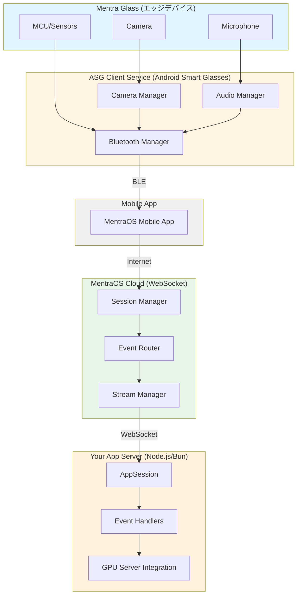

# Mentra開発者向けTips - リアルワールドAIエージェントシステム構築

このドキュメントは、`realworld_agent.md`に記載されたシステムを構築する際に必要となるMentraOSの機能と実装方法をまとめたものです。

## 目次

1. [システムアーキテクチャ概要](#システムアーキテクチャ概要)
2. [音声入力とリアルタイム文字起こし](#音声入力とリアルタイム文字起こし)
3. [カメラとフレーム取得](#カメラとフレーム取得)
4. [リアルタイムストリーミング](#リアルタイムストリーミング)
5. [イベント駆動アーキテクチャ](#イベント駆動アーキテクチャ)
6. [セッション管理とWebSocket通信](#セッション管理とwebsocket通信)
7. [推奨実装パターン](#推奨実装パターン)
8. [パフォーマンス最適化](#パフォーマンス最適化)

---

## システムアーキテクチャ概要

### MentraOSの全体構成



### 重要なコンセプト

1. **サーバーサイドアプリケーション**: MentraOSアプリはすべてサーバーサイドで動作
2. **イベント駆動**: リアルタイムデータはイベントストリームとして配信
3. **WebSocket通信**: 低遅延のリアルタイム通信
4. **セッションベース**: ユーザーごとに独立したセッション管理

---

## 音声入力とリアルタイム文字起こし

### 基本的な音声文字起こしの実装

MentraOSは**システムレベルで音声認識を提供**しており、アプリケーション側でWhisperなどを実装する必要はありません。

```typescript
import { AppServer, AppSession } from '@mentra/sdk';

class VoiceProcessingApp extends AppServer {
  protected async onSession(
    session: AppSession,
    sessionId: string,
    userId: string
  ): Promise<void> {
    session.logger.info('音声処理セッション開始');

    // リアルタイム文字起こしを購読
    const unsubscribe = session.events.onTranscription((data) => {
      // data.isFinal = false: 中間結果（リアルタイムで更新される）
      // data.isFinal = true: 最終結果（確定した文章）
      
      if (data.isFinal) {
        // 確定した文字起こし結果
        session.logger.info(`最終文字起こし: ${data.text}`);
        
        // この文字起こしを処理
        this.processTranscription(session, data.text, data.timestamp);
      } else {
        // 中間結果（リアルタイム表示用）
        session.logger.debug(`中間結果: ${data.text}`);
      }
    });

    // セッション終了時のクリーンアップ
    this.addCleanupHandler(unsubscribe);
  }

  private async processTranscription(
    session: AppSession, 
    text: string, 
    timestamp: Date
  ): Promise<void> {
    // キーワード検出
    const keywords = this.extractKeywords(text);
    
    // 重要度判定
    const importance = this.calculateImportance(text, keywords);
    
    // タイムスタンプ付きで保存
    await this.saveTranscription({
      text,
      timestamp,
      keywords,
      importance
    });
  }
}
```

### 音声活動検出（VAD）の活用

```typescript
// Voice Activity Detection - 話し始めと話し終わりの検出
session.events.onVoiceActivity((data) => {
  if (data.status === true || data.status === 'true') {
    session.logger.info('話し始めを検出');
    // 話し始めた時点でカメラ撮影準備など
  } else {
    session.logger.info('話し終わりを検出');
    // 話し終わった時点でフレームをキャプチャなど
  }
});
```

### 多言語対応とWhisperXとの統合

MentraOSの文字起こしをベースにして、サーバーサイドでWhisperXを使った後処理が可能です：

```typescript
private async enhanceTranscriptionWithWhisperX(
  text: string, 
  timestamp: Date
): Promise<EnhancedTranscription> {
  // MentraOSからの文字起こしをWhisperXで強化
  // - 単語レベルのタイムスタンプを付与
  // - 強制アラインメントで精度向上
  // - 話者分離（diarization）
  
  const enhanced = await this.whisperXService.align(text, timestamp);
  
  return {
    text,
    words: enhanced.words, // 単語ごとのタイムスタンプ
    speakers: enhanced.speakers, // 話者ID
    confidence: enhanced.confidence
  };
}
```

### 重要箇所の自動検出

```typescript
interface ImportantMoment {
  timestamp: Date;
  text: string;
  reason: string;
  relatedFrame?: Buffer;
}

private detectImportantMoments(
  transcription: string, 
  timestamp: Date
): ImportantMoment | null {
  // キーワードベースの検出
  const importantKeywords = [
    '重要', '問題', '決定', '仕様', '要件', 
    'バグ', 'エラー', '確認', 'TODO'
  ];
  
  for (const keyword of importantKeywords) {
    if (transcription.includes(keyword)) {
      return {
        timestamp,
        text: transcription,
        reason: `キーワード検出: ${keyword}`
      };
    }
  }
  
  // 固有表現抽出
  const entities = this.extractEntities(transcription);
  if (entities.length > 0) {
    return {
      timestamp,
      text: transcription,
      reason: `固有表現検出: ${entities.join(', ')}`
    };
  }
  
  return null;
}
```

### 必要な権限設定

Developer Consoleで以下の権限を設定：
- `MICROPHONE`: 音声文字起こしに必須

---

## カメラとフレーム取得

### 写真撮影の基本実装

```typescript
class PhotoCaptureApp extends AppServer {
  protected async onSession(
    session: AppSession,
    sessionId: string,
    userId: string
  ): Promise<void> {
    // ボタン押下で写真撮影
    session.events.onButtonPress(async (data) => {
      if (data.pressType === 'short') {
        await this.capturePhoto(session);
      }
    });
  }

  private async capturePhoto(session: AppSession): Promise<void> {
    try {
      // 写真撮影（サイズ指定可能）
      const photo = await session.camera.requestPhoto({
        size: 'large', // 'small' | 'medium' | 'large'
        saveToGallery: true // デバイスのギャラリーに保存
      });

      session.logger.info(`写真撮影成功: ${photo.filename}`);
      session.logger.info(`サイズ: ${photo.size} bytes, タイプ: ${photo.mimeType}`);

      // 写真データの処理
      await this.processPhoto(photo);
      
    } catch (error) {
      session.logger.error('写真撮影エラー:', error);
      await session.audio.speak('写真の撮影に失敗しました');
    }
  }

  private async processPhoto(photo: PhotoData): Promise<void> {
    // Base64エンコード
    const base64Image = photo.buffer.toString('base64');
    
    // GPUサーバーに送信して画像認識
    const analysis = await this.sendToGPUServer({
      image: base64Image,
      timestamp: photo.timestamp,
      mimeType: photo.mimeType
    });
    
    // 結果を保存
    await this.savePhotoAnalysis({
      photoId: photo.requestId,
      analysis,
      originalPhoto: photo.buffer
    });
  }
}
```

### 音声トリガーでの写真撮影

```typescript
session.events.onTranscription(async (data) => {
  if (!data.isFinal) return;
  
  const command = data.text.toLowerCase().trim();
  
  if (command.includes('写真') || command.includes('撮って')) {
    session.logger.info('音声コマンドで写真撮影');
    await this.capturePhoto(session);
  }
});
```

### 重要フレームの自動撮影

```typescript
class SmartCaptureApp extends AppServer {
  private lastCaptureTime: Date | null = null;
  private captureInterval = 30000; // 最低30秒間隔

  protected async onSession(
    session: AppSession,
    sessionId: string,
    userId: string
  ): Promise<void> {
    // 重要な発話を検出したら写真を撮影
    session.events.onTranscription(async (data) => {
      if (!data.isFinal) return;
      
      const importantMoment = this.detectImportantMoments(data.text, data.timestamp);
      
      if (importantMoment && this.shouldCapture()) {
        session.logger.info('重要箇所検出 - 自動撮影開始');
        
        const photo = await session.camera.requestPhoto({
          size: 'medium'
        });
        
        // 写真と文字起こしを関連付けて保存
        await this.saveContextualCapture({
          photo,
          transcription: data.text,
          reason: importantMoment.reason,
          timestamp: data.timestamp
        });
        
        this.lastCaptureTime = new Date();
      }
    });
  }

  private shouldCapture(): boolean {
    if (!this.lastCaptureTime) return true;
    
    const elapsed = Date.now() - this.lastCaptureTime.getTime();
    return elapsed >= this.captureInterval;
  }
}
```

### PhotoDataインターフェース

```typescript
interface PhotoData {
  buffer: Buffer;        // 写真データ（JPEG）
  mimeType: string;      // 'image/jpeg'
  filename: string;      // オリジナルのファイル名
  requestId: string;     // リクエストID
  size: number;         // バイト数
  timestamp: Date;      // 撮影時刻
}
```

### 必要な権限設定

Developer Consoleで以下の権限を設定：
- `CAMERA`: カメラ機能に必須

---

## リアルタイムストリーミング

### Managed Streaming（推奨）

Managed Streamingは、インフラ不要でHLS/DASH URLが自動生成されます。Pipecatなどの外部システムでこのストリームを取得できます。

```typescript
class LiveStreamApp extends AppServer {
  protected async onSession(
    session: AppSession,
    sessionId: string,
    userId: string
  ): Promise<void> {
    // ストリーミング開始（sessionIdとuserIdを渡す）
    await this.startManagedStreaming(session, sessionId, userId);
  }

  private async startManagedStreaming(
    session: AppSession,
    sessionId: string,
    userId: string
  ): Promise<void> {
    try {
      // Managed Streamを開始（インフラ不要）
      const result = await session.camera.startManagedStream({
        quality: '720p', // '720p' | '1080p'
        enableWebRTC: true, // 低遅延オプション
      });

      session.logger.info('ストリーミング開始');
      session.logger.info(`HLS URL: ${result.hlsUrl}`);
      session.logger.info(`DASH URL: ${result.dashUrl}`);
      session.logger.info(`WebRTC URL: ${result.webrtcUrl}`);
      session.logger.info(`Preview URL: ${result.previewUrl}`);

      // ストリームURLをGPUサーバーに送信
      await this.notifyGPUServer({
        streamUrls: {
          hls: result.hlsUrl,
          dash: result.dashUrl,
          webrtc: result.webrtcUrl
        },
        userId,
        sessionId
      });

      // ストリームステータスの監視
      const unsubscribe = session.camera.onManagedStreamStatus((status) => {
        session.logger.info(`Stream status: ${status.status}`);
        
        if (status.status === 'active') {
          session.logger.info('ストリームがアクティブになりました');
          // URLが使用可能になったことをユーザーに通知
          session.audio.speak('ストリーミングを開始しました');
        } else if (status.status === 'error') {
          session.logger.error(`Stream error: ${status.message}`);
        }
      });

      this.addCleanupHandler(unsubscribe);
      
    } catch (error) {
      session.logger.error('ストリーミング開始エラー:', error);
    }
  }

  private async stopStreaming(session: AppSession): Promise<void> {
    await session.camera.stopManagedStream();
    session.logger.info('ストリーミング停止');
  }
}
```

### 既存ストリームの確認

```typescript
// セッション開始時に既存のストリームを確認
const streamCheck = await session.camera.checkExistingStream();

if (streamCheck.hasActiveStream) {
  if (streamCheck.streamInfo?.type === 'managed') {
    // 既存のManaged Streamを再利用
    session.logger.info('既存のストリームを発見');
    session.logger.info(`HLS URL: ${streamCheck.streamInfo.hlsUrl}`);
    
    // GPUサーバーに既存のURLを送信
    await this.notifyGPUServer({
      streamUrls: {
        hls: streamCheck.streamInfo.hlsUrl,
        dash: streamCheck.streamInfo.dashUrl,
        webrtc: streamCheck.streamInfo.webrtcUrl
      }
    });
  }
} else {
  // 新しいストリームを開始
  await this.startManagedStreaming(session);
}
```

### YouTubeなどへの同時配信（Re-streaming）

```typescript
const result = await session.camera.startManagedStream({
  quality: '1080p',
  enableWebRTC: true,
  // YouTubeとTwitchに同時配信
  restreamDestinations: [
    { 
      url: 'rtmp://a.rtmp.youtube.com/live2/YOUR_YOUTUBE_STREAM_KEY',
      name: 'YouTube'
    },
    { 
      url: 'rtmp://live.twitch.tv/app/YOUR_TWITCH_STREAM_KEY',
      name: 'Twitch'
    }
  ]
});

// HLS/DASHのURLは内部視聴用、プラットフォームには自動配信される
session.logger.info(`視聴用URL: ${result.hlsUrl}`);
```

### Unmanaged Streaming（カスタムRTMPサーバー）

独自のRTMPサーバーに配信する場合：

```typescript
await session.camera.startStream({
  rtmpUrl: 'rtmp://your-custom-server.com/live/stream-key',
  video: {
    width: 1920,
    height: 1080,
    bitrate: 5000000,
    frameRate: 30
  },
  audio: {
    bitrate: 128000,
    sampleRate: 44100,
    echoCancellation: true,
    noiseSuppression: true
  }
});

// ステータス監視
session.camera.onStreamStatus((status) => {
  if (status.status === 'active' && status.stats) {
    session.logger.info(`FPS: ${status.stats.fps}`);
    session.logger.info(`Bitrate: ${status.stats.bitrate}`);
    session.logger.info(`Dropped frames: ${status.stats.droppedFrames}`);
  }
});
```

### Pipecatとの統合パターン

```typescript
class PipecatIntegrationApp extends AppServer {
  private pipecatEndpoint = 'https://your-pipecat-server.com/api';

  protected async onSession(
    session: AppSession,
    sessionId: string,
    userId: string
  ): Promise<void> {
    // Managed Streamを開始
    const stream = await session.camera.startManagedStream({
      quality: '720p',
      enableWebRTC: true
    });

    // PipecatにストリームURLを通知
    await this.registerStreamWithPipecat({
      hlsUrl: stream.hlsUrl,
      webrtcUrl: stream.webrtcUrl,
      sessionId,
      userId
    });

    // 音声文字起こしもPipecatに送信
    session.events.onTranscription(async (data) => {
      if (data.isFinal) {
        await this.sendTranscriptionToPipecat({
          text: data.text,
          timestamp: data.timestamp,
          sessionId
        });
      }
    });
  }

  private async registerStreamWithPipecat(params: {
    hlsUrl: string;
    webrtcUrl?: string;
    sessionId: string;
    userId: string;
  }): Promise<void> {
    // Pipecatにストリーム情報を登録
    await fetch(`${this.pipecatEndpoint}/register-stream`, {
      method: 'POST',
      headers: { 'Content-Type': 'application/json' },
      body: JSON.stringify(params)
    });
  }
}
```

### 注意点

- **Managed Streaming**: 複数のアプリが同時に同じストリームにアクセス可能
- **Unmanaged Streaming**: 排他的なカメラアクセス（他のアプリは使用不可）
- **バッテリー消費**: 長時間のストリーミングはバッテリーを大きく消費
- **ネットワーク**: Managed Streamingはインターネット接続が必須

---

## イベント駆動アーキテクチャ

### 利用可能なイベントタイプ

| イベント | 説明 | データ型 |
|---------|------|---------|
| `onTranscription` | リアルタイム音声文字起こし | `TranscriptionData` |
| `onVoiceActivity` | 音声活動検出（VAD） | `Vad` |
| `onButtonPress` | ハードウェアボタン押下 | `ButtonPress` |
| `onHeadPosition` | 頭の位置（上/下） | `HeadPosition` |
| `onLocation` | 位置情報更新 | `LocationUpdate` |
| `onGlassesBattery` | メガネのバッテリー状態 | `GlassesBatteryUpdate` |
| `onPhoneBattery` | スマホのバッテリー状態 | `PhoneBatteryUpdate` |
| `onPhoneNotifications` | スマホの通知 | `PhoneNotification` |
| `onAudioChunk` | 生音声データ | `AudioChunk` |

### 複数イベントの統合処理

```typescript
class MultimodalApp extends AppServer {
  private contextBuffer: ContextBuffer = {
    transcriptions: [],
    photos: [],
    locations: []
  };

  protected async onSession(
    session: AppSession,
    sessionId: string,
    userId: string
  ): Promise<void> {
    // 音声文字起こし
    session.events.onTranscription(async (data) => {
      if (data.isFinal) {
        this.contextBuffer.transcriptions.push({
          text: data.text,
          timestamp: data.timestamp
        });
        
        // コンテキストを分析
        await this.analyzeContext(session);
      }
    });

    // 位置情報
    session.events.onLocation((data) => {
      this.contextBuffer.locations.push({
        lat: data.lat,
        lng: data.lng,
        timestamp: data.timestamp
      });
    });

    // ボタン押下で写真撮影
    session.events.onButtonPress(async (data) => {
      if (data.pressType === 'short') {
        const photo = await session.camera.requestPhoto();
        this.contextBuffer.photos.push({
          photo,
          timestamp: photo.timestamp
        });
        
        await this.analyzeContext(session);
      }
    });

    // バッテリー監視
    session.events.onGlassesBattery((data) => {
      if (data.level < 20) {
        session.logger.warn(`バッテリー低下: ${data.level}%`);
        session.audio.speak('バッテリーが少なくなっています');
      }
    });
  }

  private async analyzeContext(session: AppSession): Promise<void> {
    // 直近のコンテキスト（音声・画像・位置）を統合分析
    const recentContext = this.getRecentContext(60000); // 直近1分
    
    if (this.hasSignificantContext(recentContext)) {
      // GPUサーバーでマルチモーダル分析
      const analysis = await this.sendToMultimodalRAG(recentContext);
      
      // 仕様書やコード生成
      if (analysis.requiresDocumentation) {
        await this.generateDocumentation(analysis);
      }
    }
  }

  private getRecentContext(timeWindowMs: number): ContextData {
    const now = Date.now();
    const cutoff = now - timeWindowMs;
    
    return {
      transcriptions: this.contextBuffer.transcriptions.filter(
        t => t.timestamp.getTime() > cutoff
      ),
      photos: this.contextBuffer.photos.filter(
        p => p.timestamp.getTime() > cutoff
      ),
      locations: this.contextBuffer.locations.filter(
        l => l.timestamp.getTime() > cutoff
      )
    };
  }
}
```

### イベント購読の動的制御

```typescript
class AdaptiveApp extends AppServer {
  protected async onSession(
    session: AppSession,
    sessionId: string,
    userId: string
  ): Promise<void> {
    // 設定に基づいて購読を動的に変更
    session.setSubscriptionSettings({
      updateOnChange: ['enableLocation', 'enablePhotos'],
      handler: (settings) => {
        const subscriptions = [StreamType.TRANSCRIPTION];
        
        if (settings.find(s => s.key === 'enableLocation')?.value) {
          subscriptions.push(StreamType.LOCATION_UPDATE);
        }
        
        if (settings.find(s => s.key === 'enablePhotos')?.value) {
          // カメラは設定で制御（ストリーム購読ではない）
        }
        
        return subscriptions;
      }
    });
  }
}
```

---

## セッション管理とWebSocket通信

### AppSessionのライフサイクル

```typescript
class SessionAwareApp extends AppServer {
  private activeSessions = new Map<string, SessionContext>();

  protected async onSession(
    session: AppSession,
    sessionId: string,
    userId: string
  ): Promise<void> {
    session.logger.info(`セッション開始: ${sessionId}, ユーザー: ${userId}`);

    // セッションコンテキストの初期化
    const context: SessionContext = {
      sessionId,
      userId,
      startTime: new Date(),
      transcriptionBuffer: [],
      photoBuffer: []
    };
    
    this.activeSessions.set(sessionId, context);

    // 接続イベント
    session.events.onConnected((settings) => {
      session.logger.info('WebSocket接続確立');
      session.logger.info(`初期設定: ${JSON.stringify(settings)}`);
    });

    // 切断イベント
    session.events.onDisconnected((reason) => {
      session.logger.info(`WebSocket切断: ${reason}`);
      this.handleSessionCleanup(sessionId);
    });

    // エラーイベント
    session.events.onError((error) => {
      session.logger.error('セッションエラー:', error);
      this.handleSessionError(sessionId, error);
    });

    // メインロジック
    await this.runSessionLogic(session, context);
  }

  private handleSessionCleanup(sessionId: string): void {
    const context = this.activeSessions.get(sessionId);
    if (context) {
      // セッションデータを保存
      this.saveSessionData(context);
      this.activeSessions.delete(sessionId);
    }
  }

  private async saveSessionData(context: SessionContext): Promise<void> {
    // データベースに保存
    await this.database.saveSession({
      sessionId: context.sessionId,
      userId: context.userId,
      startTime: context.startTime,
      endTime: new Date(),
      transcriptions: context.transcriptionBuffer,
      photos: context.photoBuffer
    });
  }
}
```

### 自動再接続の設定

```typescript
const appSession = new AppSession({
  packageName: 'com.example.realworld-agent',
  apiKey: process.env.MENTRAOS_API_KEY!,
  autoReconnect: true,
  maxReconnectAttempts: 5,
  reconnectDelay: 1000 // 初期遅延（指数バックオフ）
});
```

### デバイス機能の確認

```typescript
protected async onSession(
  session: AppSession,
  sessionId: string,
  userId: string
): Promise<void> {
  // デバイスのハードウェア機能を確認
  const capabilities = session.capabilities;
  
  if (capabilities) {
    session.logger.info('デバイス機能:');
    session.logger.info(`カメラ: ${capabilities.hasCamera}`);
    session.logger.info(`スピーカー: ${capabilities.hasSpeaker}`);
    session.logger.info(`マイク: ${capabilities.hasMicrophone}`);
    session.logger.info(`ディスプレイ: ${capabilities.hasDisplay}`);
    
    // 機能に応じて動作を調整
    if (capabilities.hasCamera) {
      await this.enableCameraFeatures(session);
    } else {
      session.logger.warn('カメラ非搭載デバイス - 音声のみで動作');
      await this.enableAudioOnlyMode(session);
    }
  }
}
```

---

## 推奨実装パターン

### パターン1: リアルタイム会議記録システム

```typescript
class MeetingRecorderApp extends AppServer {
  protected async onSession(
    session: AppSession,
    sessionId: string,
    userId: string
  ): Promise<void> {
    const meetingContext = {
      transcriptions: [],
      importantMoments: [],
      photos: []
    };

    // 1. リアルタイム文字起こし
    session.events.onTranscription(async (data) => {
      if (data.isFinal) {
        meetingContext.transcriptions.push({
          text: data.text,
          timestamp: data.timestamp
        });

        // 2. 重要箇所の検出
        const importance = this.analyzeImportance(data.text);
        if (importance > 0.7) {
          meetingContext.importantMoments.push({
            text: data.text,
            timestamp: data.timestamp,
            score: importance
          });

          // 3. 重要箇所で自動撮影
          const photo = await session.camera.requestPhoto({
            size: 'medium'
          });
          
          meetingContext.photos.push({
            photo,
            relatedText: data.text,
            timestamp: data.timestamp
          });
        }
      }
    });

    // 4. 定期的に要約を生成
    const summaryInterval = setInterval(async () => {
      const summary = await this.generateSummary(meetingContext);
      await this.saveSummary(summary);
      
      // ユーザーに通知
      session.audio.speak('会議記録を更新しました');
    }, 5 * 60 * 1000); // 5分ごと

    // クリーンアップ
    this.addCleanupHandler(() => {
      clearInterval(summaryInterval);
      this.finalizeRecording(meetingContext);
    });
  }

  private async finalizeRecording(context: MeetingContext): Promise<void> {
    // 最終要約
    const finalSummary = await this.generateFinalSummary(context);
    
    // 仕様書生成
    const specification = await this.generateSpecification(context);
    
    // Slackなどに送信
    await this.notifyTeam({
      summary: finalSummary,
      specification,
      photos: context.photos
    });
  }
}
```

### パターン2: 現場作業支援システム

```typescript
class FieldWorkAssistantApp extends AppServer {
  protected async onSession(
    session: AppSession,
    sessionId: string,
    userId: string
  ): Promise<void> {
    // 位置情報の追跡
    session.events.onLocation((data) => {
      this.updateUserLocation(userId, data);
    });

    // 音声コマンド処理
    session.events.onTranscription(async (data) => {
      if (!data.isFinal) return;

      const command = this.parseCommand(data.text);
      
      switch (command.type) {
        case 'TAKE_PHOTO':
          await this.documentWork(session, command.params);
          break;
          
        case 'START_RECORDING':
          await this.startWorkRecording(session);
          break;
          
        case 'REPORT_ISSUE':
          await this.createIssueReport(session, command.params);
          break;
          
        case 'QUERY_MANUAL':
          const answer = await this.queryManual(command.params.query);
          await session.audio.speak(answer);
          break;
      }
    });

    // ボタンで緊急通知
    session.events.onButtonPress(async (data) => {
      if (data.pressType === 'long') {
        await this.sendEmergencyAlert(session, userId);
      }
    });
  }

  private async documentWork(
    session: AppSession,
    params: any
  ): Promise<void> {
    // 作業記録用の写真撮影
    const photo = await session.camera.requestPhoto({
      size: 'large',
      saveToGallery: true
    });

    // 現在位置を取得（accuracy指定が必須）
    const location = await session.location.getLatestLocation({ 
      accuracy: 'hundredMeters' 
    });

    // 記録を保存
    await this.saveWorkLog({
      photo,
      location,
      timestamp: new Date(),
      notes: params.notes
    });

    await session.audio.speak('作業を記録しました');
  }
}
```

### パターン3: GPUサーバーとの統合

```typescript
class GPUIntegratedApp extends AppServer {
  private gpuServerUrl = 'https://your-gpu-server.com/api';

  protected async onSession(
    session: AppSession,
    sessionId: string,
    userId: string
  ): Promise<void> {
    // ストリーミング開始
    const stream = await session.camera.startManagedStream({
      quality: '720p',
      enableWebRTC: true
    });

    // GPUサーバーに登録
    await this.registerWithGPUServer({
      sessionId,
      userId,
      streamUrls: {
        hls: stream.hlsUrl,
        webrtc: stream.webrtcUrl
      }
    });

    // 音声とビデオをリアルタイムで処理
    session.events.onTranscription(async (data) => {
      if (data.isFinal) {
        // GPUサーバーに送信
        const analysis = await this.sendToGPUServer({
          type: 'transcription',
          data: data.text,
          timestamp: data.timestamp,
          sessionId
        });

        // 分析結果に基づいてアクション
        if (analysis.action === 'capture_frame') {
          await session.camera.requestPhoto();
        }
      }
    });
  }

  private async sendToGPUServer(payload: any): Promise<any> {
    const response = await fetch(`${this.gpuServerUrl}/analyze`, {
      method: 'POST',
      headers: { 'Content-Type': 'application/json' },
      body: JSON.stringify(payload)
    });
    
    return response.json();
  }
}
```

---

## パフォーマンス最適化

### 1. バッファリングとバッチ処理

```typescript
class OptimizedApp extends AppServer {
  private transcriptionBuffer: TranscriptionData[] = [];
  private bufferFlushInterval = 5000; // 5秒

  protected async onSession(
    session: AppSession,
    sessionId: string,
    userId: string
  ): Promise<void> {
    // バッファリング
    session.events.onTranscription((data) => {
      if (data.isFinal) {
        this.transcriptionBuffer.push(data);
      }
    });

    // 定期的にバッチ処理
    const flushTimer = setInterval(async () => {
      if (this.transcriptionBuffer.length > 0) {
        await this.processBatch(this.transcriptionBuffer);
        this.transcriptionBuffer = [];
      }
    }, this.bufferFlushInterval);

    this.addCleanupHandler(() => clearInterval(flushTimer));
  }

  private async processBatch(batch: TranscriptionData[]): Promise<void> {
    // バッチでGPUサーバーに送信（効率的）
    await this.sendToGPUServer({
      type: 'batch_transcription',
      data: batch
    });
  }
}
```

### 2. メモリ管理

```typescript
class MemoryEfficientApp extends AppServer {
  private maxBufferSize = 100;
  private contextWindow = 300000; // 5分間のコンテキスト

  private cleanupOldData(buffer: any[]): any[] {
    const now = Date.now();
    
    // 古いデータを削除
    return buffer.filter(item => 
      now - item.timestamp.getTime() < this.contextWindow
    ).slice(-this.maxBufferSize);
  }

  protected async onSession(
    session: AppSession,
    sessionId: string,
    userId: string
  ): Promise<void> {
    const context = {
      transcriptions: [],
      photos: []
    };

    session.events.onTranscription((data) => {
      if (data.isFinal) {
        context.transcriptions.push(data);
        // 定期的にクリーンアップ
        context.transcriptions = this.cleanupOldData(context.transcriptions);
      }
    });
  }
}
```

### 3. 写真サイズの最適化

```typescript
// 用途に応じてサイズを選択
const thumbnailPhoto = await session.camera.requestPhoto({
  size: 'small'  // クイックプレビュー用
});

const normalPhoto = await session.camera.requestPhoto({
  size: 'medium'  // 通常の記録用（デフォルト）
});

const highQualityPhoto = await session.camera.requestPhoto({
  size: 'large'  // 詳細な分析用
});
```

### 4. ストリーミング品質の調整

```typescript
// ネットワーク状況に応じて品質を調整
const networkQuality = await this.checkNetworkQuality();

const quality = networkQuality > 0.7 ? '1080p' : '720p';

await session.camera.startManagedStream({
  quality,
  enableWebRTC: networkQuality > 0.8 // 良好な場合のみWebRTC
});
```

---

## システム統合のベストプラクティス

### 1. エラーハンドリング

```typescript
class RobustApp extends AppServer {
  protected async onSession(
    session: AppSession,
    sessionId: string,
    userId: string
  ): Promise<void> {
    // グローバルエラーハンドラ
    session.events.onError(async (error) => {
      session.logger.error('システムエラー:', error);
      
      // ユーザーに通知
      await session.audio.speak('エラーが発生しました。再試行します。');
      
      // エラー報告
      await this.reportError({
        sessionId,
        userId,
        error: error.message,
        timestamp: new Date()
      });
    });

    // 個別の処理でもエラーハンドリング
    try {
      const photo = await session.camera.requestPhoto();
      await this.processPhoto(photo);
    } catch (error) {
      session.logger.error('写真処理エラー:', error);
      // フォールバック処理
      await this.handlePhotoFailure(session);
    }
  }
}
```

### 2. ログとモニタリング

```typescript
class MonitoredApp extends AppServer {
  protected async onSession(
    session: AppSession,
    sessionId: string,
    userId: string
  ): Promise<void> {
    // 構造化ログ
    session.logger.info('セッション開始', {
      sessionId,
      userId,
      deviceCapabilities: session.capabilities
    });

    // パフォーマンスメトリクス
    const startTime = Date.now();
    
    session.events.onTranscription(async (data) => {
      if (data.isFinal) {
        const latency = Date.now() - data.timestamp.getTime();
        
        session.logger.debug('文字起こし処理', {
          latency,
          textLength: data.text.length
        });
      }
    });
  }
}
```

### 3. 設定管理

```typescript
// Developer Consoleで設定を定義
// ユーザーはMentraOSアプリから設定を変更可能

protected async onSession(
  session: AppSession,
  sessionId: string,
  userId: string
): Promise<void> {
  // 設定の取得
  const autoCapture = session.settings.get<boolean>('autoCapture', false);
  const captureInterval = session.settings.get<number>('captureInterval', 30);
  
  session.logger.info(`設定: 自動撮影=${autoCapture}, 間隔=${captureInterval}秒`);

  // 設定変更の監視
  session.events.onSettingChange<boolean>('autoCapture', (newValue, oldValue) => {
    session.logger.info(`自動撮影設定変更: ${oldValue} → ${newValue}`);
    
    if (newValue) {
      this.enableAutoCapture(session, captureInterval);
    } else {
      this.disableAutoCapture();
    }
  });
}
```

---

## 次のステップ

1. **開発環境のセットアップ**
   - Bun/Node.jsのインストール
   - MentraOS SDKのインストール: `bun add @mentra/sdk`
   - Developer Consoleでアプリを作成: https://console.mentra.glass/

2. **GPUサーバーの準備**
   - Pipecatのセットアップ
   - WhisperX/Whisper.cppの環境構築
   - RAGシステムの構築

3. **プロトタイプの作成**
   - Webカメラ + PC環境でテスト
   - Mentra Glassでの検証
   - 本番環境へのデプロイ

4. **参考リソース**
   - [MentraOS Documentation](https://docs.mentraglass.com/) - 公式ドキュメント
   - [Developer Portal](https://console.mentra.glass/) - アプリ登録とAPI Key取得
   - [GitHub Repository](https://github.com/BaseApp-io/mentra-os) - MentraOSリポジトリ
   - [Example Apps](https://github.com/BaseApp-io/mentra-example-apps) - サンプルアプリ
   - [Discord Community](https://discord.gg/mentra) - コミュニティサポート

---

## まとめ

このドキュメントでカバーした内容：

✅ **音声**: リアルタイム文字起こし、VAD、重要箇所検出
✅ **カメラ**: 写真撮影、自動キャプチャ、コンテキスト連携
✅ **ストリーミング**: Managed/Unmanaged Stream、Pipecat統合
✅ **イベント**: マルチモーダルイベントの統合処理
✅ **セッション**: ライフサイクル管理、再接続、エラーハンドリング
✅ **パフォーマンス**: バッファリング、メモリ管理、最適化

これらの知識を活用して、リアル世界のAIエージェントシステムを構築できます。

